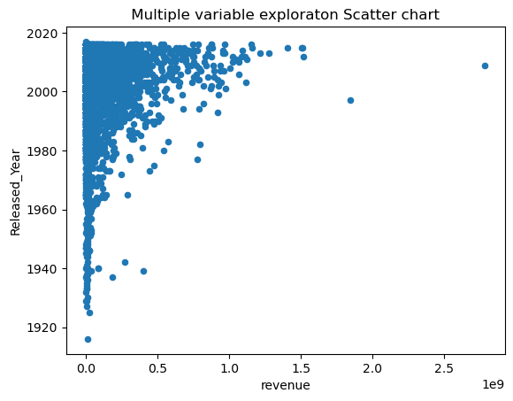
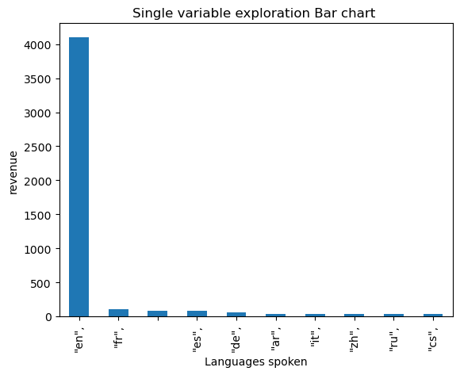

```python
! pip install opendatasets
```

    Requirement already satisfied: opendatasets in c:\users\lttc1\anaconda3\lib\site-packages (0.1.22)
    Requirement already satisfied: tqdm in c:\users\lttc1\anaconda3\lib\site-packages (from opendatasets) (4.65.0)
    Requirement already satisfied: kaggle in c:\users\lttc1\anaconda3\lib\site-packages (from opendatasets) (1.5.16)
    Requirement already satisfied: click in c:\users\lttc1\anaconda3\lib\site-packages (from opendatasets) (8.0.4)
    Requirement already satisfied: colorama in c:\users\lttc1\anaconda3\lib\site-packages (from click->opendatasets) (0.4.6)
    Requirement already satisfied: six>=1.10 in c:\users\lttc1\anaconda3\lib\site-packages (from kaggle->opendatasets) (1.16.0)
    Requirement already satisfied: certifi in c:\users\lttc1\anaconda3\lib\site-packages (from kaggle->opendatasets) (2023.7.22)
    Requirement already satisfied: python-dateutil in c:\users\lttc1\anaconda3\lib\site-packages (from kaggle->opendatasets) (2.8.2)
    Requirement already satisfied: requests in c:\users\lttc1\anaconda3\lib\site-packages (from kaggle->opendatasets) (2.31.0)
    Requirement already satisfied: python-slugify in c:\users\lttc1\anaconda3\lib\site-packages (from kaggle->opendatasets) (5.0.2)
    Requirement already satisfied: urllib3 in c:\users\lttc1\anaconda3\lib\site-packages (from kaggle->opendatasets) (1.26.16)
    Requirement already satisfied: bleach in c:\users\lttc1\anaconda3\lib\site-packages (from kaggle->opendatasets) (4.1.0)
    Requirement already satisfied: packaging in c:\users\lttc1\anaconda3\lib\site-packages (from bleach->kaggle->opendatasets) (23.0)
    Requirement already satisfied: webencodings in c:\users\lttc1\anaconda3\lib\site-packages (from bleach->kaggle->opendatasets) (0.5.1)
    Requirement already satisfied: text-unidecode>=1.3 in c:\users\lttc1\anaconda3\lib\site-packages (from python-slugify->kaggle->opendatasets) (1.3)
    Requirement already satisfied: charset-normalizer<4,>=2 in c:\users\lttc1\anaconda3\lib\site-packages (from requests->kaggle->opendatasets) (2.0.4)
    Requirement already satisfied: idna<4,>=2.5 in c:\users\lttc1\anaconda3\lib\site-packages (from requests->kaggle->opendatasets) (3.4)
    


```python
import opendatasets as od
```


```python
dataset = 'https://www.kaggle.com/datasets/harshitshankhdhar/imdb-dataset-of-top-1000-movies-and-tv-shows'
```


```python
od.download(dataset)
```

    Skipping, found downloaded files in ".\imdb-dataset-of-top-1000-movies-and-tv-shows" (use force=True to force download)
    


```python
import os 
```


```python
data_dir = '.\imdb-dataset-of-top-1000-movies-and-tv-shows'
```


```python
os.listdir(data_dir)
```


    ['imdb_top_1000.csv']


```python
import pandas as pd
```


```python
df1 = pd.read_csv('imdb-dataset-of-top-1000-movies-and-tv-shows/imdb_top_1000.csv')
```


```python
df1.head(60)
```


<div>
<style scoped>
    .dataframe tbody tr th:only-of-type {
        vertical-align: middle;
    }

    .dataframe tbody tr th {
        vertical-align: top;
    }

    .dataframe thead th {
        text-align: right;
    }
</style>
<table border="1" class="dataframe">
  <thead>
    <tr style="text-align: right;">
      <th></th>
      <th>Poster_Link</th>
      <th>Series_Title</th>
      <th>Released_Year</th>
      <th>Certificate</th>
      <th>Runtime</th>
      <th>Genre</th>
      <th>IMDB_Rating</th>
      <th>Overview</th>
      <th>Meta_score</th>
      <th>Director</th>
      <th>Star1</th>
      <th>Star2</th>
      <th>Star3</th>
      <th>Star4</th>
      <th>No_of_Votes</th>
      <th>Gross</th>
    </tr>
  </thead>
  <tbody>
    <tr>
      <th>0</th>
      <td>https://m.media-amazon.com/images/M/MV5BMDFkYT...</td>
      <td>The Shawshank Redemption</td>
      <td>1994</td>
      <td>A</td>
      <td>142 min</td>
      <td>Drama</td>
      <td>9.3</td>
      <td>Two imprisoned men bond over a number of years...</td>
      <td>80.0</td>
      <td>Frank Darabont</td>
      <td>Tim Robbins</td>
      <td>Morgan Freeman</td>
      <td>Bob Gunton</td>
      <td>William Sadler</td>
      <td>2343110</td>
      <td>28,341,469</td>
    </tr>
    <tr>
      <th>1</th>
      <td>https://m.media-amazon.com/images/M/MV5BM2MyNj...</td>
      <td>The Godfather</td>
      <td>1972</td>
      <td>A</td>
      <td>175 min</td>
      <td>Crime, Drama</td>
      <td>9.2</td>
      <td>An organized crime dynasty's aging patriarch t...</td>
      <td>100.0</td>
      <td>Francis Ford Coppola</td>
      <td>Marlon Brando</td>
      <td>Al Pacino</td>
      <td>James Caan</td>
      <td>Diane Keaton</td>
      <td>1620367</td>
      <td>134,966,411</td>
    </tr>
    <tr>
      <th>2</th>
      <td>https://m.media-amazon.com/images/M/MV5BMTMxNT...</td>
      <td>The Dark Knight</td>
      <td>2008</td>
      <td>UA</td>
      <td>152 min</td>
      <td>Action, Crime, Drama</td>
      <td>9.0</td>
      <td>When the menace known as the Joker wreaks havo...</td>
      <td>84.0</td>
      <td>Christopher Nolan</td>
      <td>Christian Bale</td>
      <td>Heath Ledger</td>
      <td>Aaron Eckhart</td>
      <td>Michael Caine</td>
      <td>2303232</td>
      <td>534,858,444</td>
    </tr>
    <tr>
      <th>3</th>
      <td>https://m.media-amazon.com/images/M/MV5BMWMwMG...</td>
      <td>The Godfather: Part II</td>
      <td>1974</td>
      <td>A</td>
      <td>202 min</td>
      <td>Crime, Drama</td>
      <td>9.0</td>
      <td>The early life and career of Vito Corleone in ...</td>
      <td>90.0</td>
      <td>Francis Ford Coppola</td>
      <td>Al Pacino</td>
      <td>Robert De Niro</td>
      <td>Robert Duvall</td>
      <td>Diane Keaton</td>
      <td>1129952</td>
      <td>57,300,000</td>
    </tr>
    <tr>
      <th>4</th>
      <td>https://m.media-amazon.com/images/M/MV5BMWU4N2...</td>
      <td>12 Angry Men</td>
      <td>1957</td>
      <td>U</td>
      <td>96 min</td>
      <td>Crime, Drama</td>
      <td>9.0</td>
      <td>A jury holdout attempts to prevent a miscarria...</td>
      <td>96.0</td>
      <td>Sidney Lumet</td>
      <td>Henry Fonda</td>
      <td>Lee J. Cobb</td>
      <td>Martin Balsam</td>
      <td>John Fiedler</td>
      <td>689845</td>
      <td>4,360,000</td>
    </tr>
    <tr>
      <th>5</th>
      <td>https://m.media-amazon.com/images/M/MV5BNzA5ZD...</td>
      <td>The Lord of the Rings: The Return of the King</td>
      <td>2003</td>
      <td>U</td>
      <td>201 min</td>
      <td>Action, Adventure, Drama</td>
      <td>8.9</td>
      <td>Gandalf and Aragorn lead the World of Men agai...</td>
      <td>94.0</td>
      <td>Peter Jackson</td>
      <td>Elijah Wood</td>
      <td>Viggo Mortensen</td>
      <td>Ian McKellen</td>
      <td>Orlando Bloom</td>
      <td>1642758</td>
      <td>377,845,905</td>
    </tr>
    <tr>
      <th>6</th>
      <td>https://m.media-amazon.com/images/M/MV5BNGNhMD...</td>
      <td>Pulp Fiction</td>
      <td>1994</td>
      <td>A</td>
      <td>154 min</td>
      <td>Crime, Drama</td>
      <td>8.9</td>
      <td>The lives of two mob hitmen, a boxer, a gangst...</td>
      <td>94.0</td>
      <td>Quentin Tarantino</td>
      <td>John Travolta</td>
      <td>Uma Thurman</td>
      <td>Samuel L. Jackson</td>
      <td>Bruce Willis</td>
      <td>1826188</td>
      <td>107,928,762</td>
    </tr>
    <tr>
      <th>7</th>
      <td>https://m.media-amazon.com/images/M/MV5BNDE4OT...</td>
      <td>Schindler's List</td>
      <td>1993</td>
      <td>A</td>
      <td>195 min</td>
      <td>Biography, Drama, History</td>
      <td>8.9</td>
      <td>In German-occupied Poland during World War II,...</td>
      <td>94.0</td>
      <td>Steven Spielberg</td>
      <td>Liam Neeson</td>
      <td>Ralph Fiennes</td>
      <td>Ben Kingsley</td>
      <td>Caroline Goodall</td>
      <td>1213505</td>
      <td>96,898,818</td>
    </tr>
    <tr>
      <th>8</th>
      <td>https://m.media-amazon.com/images/M/MV5BMjAxMz...</td>
      <td>Inception</td>
      <td>2010</td>
      <td>UA</td>
      <td>148 min</td>
      <td>Action, Adventure, Sci-Fi</td>
      <td>8.8</td>
      <td>A thief who steals corporate secrets through t...</td>
      <td>74.0</td>
      <td>Christopher Nolan</td>
      <td>Leonardo DiCaprio</td>
      <td>Joseph Gordon-Levitt</td>
      <td>Elliot Page</td>
      <td>Ken Watanabe</td>
      <td>2067042</td>
      <td>292,576,195</td>
    </tr>
    <tr>
      <th>9</th>
      <td>https://m.media-amazon.com/images/M/MV5BMmEzNT...</td>
      <td>Fight Club</td>
      <td>1999</td>
      <td>A</td>
      <td>139 min</td>
      <td>Drama</td>
      <td>8.8</td>
      <td>An insomniac office worker and a devil-may-car...</td>
      <td>66.0</td>
      <td>David Fincher</td>
      <td>Brad Pitt</td>
      <td>Edward Norton</td>
      <td>Meat Loaf</td>
      <td>Zach Grenier</td>
      <td>1854740</td>
      <td>37,030,102</td>
    </tr>
    <tr>
      <th>10</th>
      <td>https://m.media-amazon.com/images/M/MV5BN2EyZj...</td>
      <td>The Lord of the Rings: The Fellowship of the Ring</td>
      <td>2001</td>
      <td>U</td>
      <td>178 min</td>
      <td>Action, Adventure, Drama</td>
      <td>8.8</td>
      <td>A meek Hobbit from the Shire and eight compani...</td>
      <td>92.0</td>
      <td>Peter Jackson</td>
      <td>Elijah Wood</td>
      <td>Ian McKellen</td>
      <td>Orlando Bloom</td>
      <td>Sean Bean</td>
      <td>1661481</td>
      <td>315,544,750</td>
    </tr>
    <tr>
      <th>11</th>
      <td>https://m.media-amazon.com/images/M/MV5BNWIwOD...</td>
      <td>Forrest Gump</td>
      <td>1994</td>
      <td>UA</td>
      <td>142 min</td>
      <td>Drama, Romance</td>
      <td>8.8</td>
      <td>The presidencies of Kennedy and Johnson, the e...</td>
      <td>82.0</td>
      <td>Robert Zemeckis</td>
      <td>Tom Hanks</td>
      <td>Robin Wright</td>
      <td>Gary Sinise</td>
      <td>Sally Field</td>
      <td>1809221</td>
      <td>330,252,182</td>
    </tr>
    <tr>
      <th>12</th>
      <td>https://m.media-amazon.com/images/M/MV5BOTQ5ND...</td>
      <td>Il buono, il brutto, il cattivo</td>
      <td>1966</td>
      <td>A</td>
      <td>161 min</td>
      <td>Western</td>
      <td>8.8</td>
      <td>A bounty hunting scam joins two men in an unea...</td>
      <td>90.0</td>
      <td>Sergio Leone</td>
      <td>Clint Eastwood</td>
      <td>Eli Wallach</td>
      <td>Lee Van Cleef</td>
      <td>Aldo Giuffrè</td>
      <td>688390</td>
      <td>6,100,000</td>
    </tr>
    <tr>
      <th>13</th>
      <td>https://m.media-amazon.com/images/M/MV5BZGMxZT...</td>
      <td>The Lord of the Rings: The Two Towers</td>
      <td>2002</td>
      <td>UA</td>
      <td>179 min</td>
      <td>Action, Adventure, Drama</td>
      <td>8.7</td>
      <td>While Frodo and Sam edge closer to Mordor with...</td>
      <td>87.0</td>
      <td>Peter Jackson</td>
      <td>Elijah Wood</td>
      <td>Ian McKellen</td>
      <td>Viggo Mortensen</td>
      <td>Orlando Bloom</td>
      <td>1485555</td>
      <td>342,551,365</td>
    </tr>
    <tr>
      <th>14</th>
      <td>https://m.media-amazon.com/images/M/MV5BNzQzOT...</td>
      <td>The Matrix</td>
      <td>1999</td>
      <td>A</td>
      <td>136 min</td>
      <td>Action, Sci-Fi</td>
      <td>8.7</td>
      <td>When a beautiful stranger leads computer hacke...</td>
      <td>73.0</td>
      <td>Lana Wachowski</td>
      <td>Lilly Wachowski</td>
      <td>Keanu Reeves</td>
      <td>Laurence Fishburne</td>
      <td>Carrie-Anne Moss</td>
      <td>1676426</td>
      <td>171,479,930</td>
    </tr>
    <tr>
      <th>15</th>
      <td>https://m.media-amazon.com/images/M/MV5BY2NkZj...</td>
      <td>Goodfellas</td>
      <td>1990</td>
      <td>A</td>
      <td>146 min</td>
      <td>Biography, Crime, Drama</td>
      <td>8.7</td>
      <td>The story of Henry Hill and his life in the mo...</td>
      <td>90.0</td>
      <td>Martin Scorsese</td>
      <td>Robert De Niro</td>
      <td>Ray Liotta</td>
      <td>Joe Pesci</td>
      <td>Lorraine Bracco</td>
      <td>1020727</td>
      <td>46,836,394</td>
    </tr>
    <tr>
      <th>16</th>
      <td>https://m.media-amazon.com/images/M/MV5BYmU1ND...</td>
      <td>Star Wars: Episode V - The Empire Strikes Back</td>
      <td>1980</td>
      <td>UA</td>
      <td>124 min</td>
      <td>Action, Adventure, Fantasy</td>
      <td>8.7</td>
      <td>After the Rebels are brutally overpowered by t...</td>
      <td>82.0</td>
      <td>Irvin Kershner</td>
      <td>Mark Hamill</td>
      <td>Harrison Ford</td>
      <td>Carrie Fisher</td>
      <td>Billy Dee Williams</td>
      <td>1159315</td>
      <td>290,475,067</td>
    </tr>
    <tr>
      <th>17</th>
      <td>https://m.media-amazon.com/images/M/MV5BZjA0OW...</td>
      <td>One Flew Over the Cuckoo's Nest</td>
      <td>1975</td>
      <td>A</td>
      <td>133 min</td>
      <td>Drama</td>
      <td>8.7</td>
      <td>A criminal pleads insanity and is admitted to ...</td>
      <td>83.0</td>
      <td>Milos Forman</td>
      <td>Jack Nicholson</td>
      <td>Louise Fletcher</td>
      <td>Michael Berryman</td>
      <td>Peter Brocco</td>
      <td>918088</td>
      <td>112,000,000</td>
    </tr>
    <tr>
      <th>18</th>
      <td>https://m.media-amazon.com/images/M/MV5BNjViNW...</td>
      <td>Hamilton</td>
      <td>2020</td>
      <td>PG-13</td>
      <td>160 min</td>
      <td>Biography, Drama, History</td>
      <td>8.6</td>
      <td>The real life of one of America's foremost fou...</td>
      <td>90.0</td>
      <td>Thomas Kail</td>
      <td>Lin-Manuel Miranda</td>
      <td>Phillipa Soo</td>
      <td>Leslie Odom Jr.</td>
      <td>Renée Elise Goldsberry</td>
      <td>55291</td>
      <td>NaN</td>
    </tr>
    <tr>
      <th>19</th>
      <td>https://m.media-amazon.com/images/M/MV5BYWZjMj...</td>
      <td>Gisaengchung</td>
      <td>2019</td>
      <td>A</td>
      <td>132 min</td>
      <td>Comedy, Drama, Thriller</td>
      <td>8.6</td>
      <td>Greed and class discrimination threaten the ne...</td>
      <td>96.0</td>
      <td>Bong Joon Ho</td>
      <td>Kang-ho Song</td>
      <td>Lee Sun-kyun</td>
      <td>Cho Yeo-jeong</td>
      <td>Choi Woo-sik</td>
      <td>552778</td>
      <td>53,367,844</td>
    </tr>
    <tr>
      <th>20</th>
      <td>https://m.media-amazon.com/images/M/MV5BOTc2ZT...</td>
      <td>Soorarai Pottru</td>
      <td>2020</td>
      <td>U</td>
      <td>153 min</td>
      <td>Drama</td>
      <td>8.6</td>
      <td>Nedumaaran Rajangam "Maara" sets out to make t...</td>
      <td>NaN</td>
      <td>Sudha Kongara</td>
      <td>Suriya</td>
      <td>Madhavan</td>
      <td>Paresh Rawal</td>
      <td>Aparna Balamurali</td>
      <td>54995</td>
      <td>NaN</td>
    </tr>
    <tr>
      <th>21</th>
      <td>https://m.media-amazon.com/images/M/MV5BZjdkOT...</td>
      <td>Interstellar</td>
      <td>2014</td>
      <td>UA</td>
      <td>169 min</td>
      <td>Adventure, Drama, Sci-Fi</td>
      <td>8.6</td>
      <td>A team of explorers travel through a wormhole ...</td>
      <td>74.0</td>
      <td>Christopher Nolan</td>
      <td>Matthew McConaughey</td>
      <td>Anne Hathaway</td>
      <td>Jessica Chastain</td>
      <td>Mackenzie Foy</td>
      <td>1512360</td>
      <td>188,020,017</td>
    </tr>
    <tr>
      <th>22</th>
      <td>https://m.media-amazon.com/images/M/MV5BOTMwYj...</td>
      <td>Cidade de Deus</td>
      <td>2002</td>
      <td>A</td>
      <td>130 min</td>
      <td>Crime, Drama</td>
      <td>8.6</td>
      <td>In the slums of Rio, two kids' paths diverge a...</td>
      <td>79.0</td>
      <td>Fernando Meirelles</td>
      <td>Kátia Lund</td>
      <td>Alexandre Rodrigues</td>
      <td>Leandro Firmino</td>
      <td>Matheus Nachtergaele</td>
      <td>699256</td>
      <td>7,563,397</td>
    </tr>
    <tr>
      <th>23</th>
      <td>https://m.media-amazon.com/images/M/MV5BMjlmZm...</td>
      <td>Sen to Chihiro no kamikakushi</td>
      <td>2001</td>
      <td>U</td>
      <td>125 min</td>
      <td>Animation, Adventure, Family</td>
      <td>8.6</td>
      <td>During her family's move to the suburbs, a sul...</td>
      <td>96.0</td>
      <td>Hayao Miyazaki</td>
      <td>Daveigh Chase</td>
      <td>Suzanne Pleshette</td>
      <td>Miyu Irino</td>
      <td>Rumi Hiiragi</td>
      <td>651376</td>
      <td>10,055,859</td>
    </tr>
    <tr>
      <th>24</th>
      <td>https://m.media-amazon.com/images/M/MV5BZjhkMD...</td>
      <td>Saving Private Ryan</td>
      <td>1998</td>
      <td>R</td>
      <td>169 min</td>
      <td>Drama, War</td>
      <td>8.6</td>
      <td>Following the Normandy Landings, a group of U....</td>
      <td>91.0</td>
      <td>Steven Spielberg</td>
      <td>Tom Hanks</td>
      <td>Matt Damon</td>
      <td>Tom Sizemore</td>
      <td>Edward Burns</td>
      <td>1235804</td>
      <td>216,540,909</td>
    </tr>
    <tr>
      <th>25</th>
      <td>https://m.media-amazon.com/images/M/MV5BMTUxMz...</td>
      <td>The Green Mile</td>
      <td>1999</td>
      <td>A</td>
      <td>189 min</td>
      <td>Crime, Drama, Fantasy</td>
      <td>8.6</td>
      <td>The lives of guards on Death Row are affected ...</td>
      <td>61.0</td>
      <td>Frank Darabont</td>
      <td>Tom Hanks</td>
      <td>Michael Clarke Duncan</td>
      <td>David Morse</td>
      <td>Bonnie Hunt</td>
      <td>1147794</td>
      <td>136,801,374</td>
    </tr>
    <tr>
      <th>26</th>
      <td>https://m.media-amazon.com/images/M/MV5BYmJmM2...</td>
      <td>La vita è bella</td>
      <td>1997</td>
      <td>U</td>
      <td>116 min</td>
      <td>Comedy, Drama, Romance</td>
      <td>8.6</td>
      <td>When an open-minded Jewish librarian and his s...</td>
      <td>59.0</td>
      <td>Roberto Benigni</td>
      <td>Roberto Benigni</td>
      <td>Nicoletta Braschi</td>
      <td>Giorgio Cantarini</td>
      <td>Giustino Durano</td>
      <td>623629</td>
      <td>57,598,247</td>
    </tr>
    <tr>
      <th>27</th>
      <td>https://m.media-amazon.com/images/M/MV5BOTUwOD...</td>
      <td>Se7en</td>
      <td>1995</td>
      <td>A</td>
      <td>127 min</td>
      <td>Crime, Drama, Mystery</td>
      <td>8.6</td>
      <td>Two detectives, a rookie and a veteran, hunt a...</td>
      <td>65.0</td>
      <td>David Fincher</td>
      <td>Morgan Freeman</td>
      <td>Brad Pitt</td>
      <td>Kevin Spacey</td>
      <td>Andrew Kevin Walker</td>
      <td>1445096</td>
      <td>100,125,643</td>
    </tr>
    <tr>
      <th>28</th>
      <td>https://m.media-amazon.com/images/M/MV5BNjNhZT...</td>
      <td>The Silence of the Lambs</td>
      <td>1991</td>
      <td>A</td>
      <td>118 min</td>
      <td>Crime, Drama, Thriller</td>
      <td>8.6</td>
      <td>A young F.B.I. cadet must receive the help of ...</td>
      <td>85.0</td>
      <td>Jonathan Demme</td>
      <td>Jodie Foster</td>
      <td>Anthony Hopkins</td>
      <td>Lawrence A. Bonney</td>
      <td>Kasi Lemmons</td>
      <td>1270197</td>
      <td>130,742,922</td>
    </tr>
    <tr>
      <th>29</th>
      <td>https://m.media-amazon.com/images/M/MV5BNzVlY2...</td>
      <td>Star Wars</td>
      <td>1977</td>
      <td>UA</td>
      <td>121 min</td>
      <td>Action, Adventure, Fantasy</td>
      <td>8.6</td>
      <td>Luke Skywalker joins forces with a Jedi Knight...</td>
      <td>90.0</td>
      <td>George Lucas</td>
      <td>Mark Hamill</td>
      <td>Harrison Ford</td>
      <td>Carrie Fisher</td>
      <td>Alec Guinness</td>
      <td>1231473</td>
      <td>322,740,140</td>
    </tr>
    <tr>
      <th>30</th>
      <td>https://m.media-amazon.com/images/M/MV5BYjBmYT...</td>
      <td>Seppuku</td>
      <td>1962</td>
      <td>NaN</td>
      <td>133 min</td>
      <td>Action, Drama, Mystery</td>
      <td>8.6</td>
      <td>When a ronin requesting seppuku at a feudal lo...</td>
      <td>85.0</td>
      <td>Masaki Kobayashi</td>
      <td>Tatsuya Nakadai</td>
      <td>Akira Ishihama</td>
      <td>Shima Iwashita</td>
      <td>Tetsurô Tanba</td>
      <td>42004</td>
      <td>NaN</td>
    </tr>
    <tr>
      <th>31</th>
      <td>https://m.media-amazon.com/images/M/MV5BOWE4ZD...</td>
      <td>Shichinin no samurai</td>
      <td>1954</td>
      <td>U</td>
      <td>207 min</td>
      <td>Action, Adventure, Drama</td>
      <td>8.6</td>
      <td>A poor village under attack by bandits recruit...</td>
      <td>98.0</td>
      <td>Akira Kurosawa</td>
      <td>Toshirô Mifune</td>
      <td>Takashi Shimura</td>
      <td>Keiko Tsushima</td>
      <td>Yukiko Shimazaki</td>
      <td>315744</td>
      <td>269,061</td>
    </tr>
    <tr>
      <th>32</th>
      <td>https://m.media-amazon.com/images/M/MV5BZjc4ND...</td>
      <td>It's a Wonderful Life</td>
      <td>1946</td>
      <td>PG</td>
      <td>130 min</td>
      <td>Drama, Family, Fantasy</td>
      <td>8.6</td>
      <td>An angel is sent from Heaven to help a despera...</td>
      <td>89.0</td>
      <td>Frank Capra</td>
      <td>James Stewart</td>
      <td>Donna Reed</td>
      <td>Lionel Barrymore</td>
      <td>Thomas Mitchell</td>
      <td>405801</td>
      <td>NaN</td>
    </tr>
    <tr>
      <th>33</th>
      <td>https://m.media-amazon.com/images/M/MV5BNGVjNW...</td>
      <td>Joker</td>
      <td>2019</td>
      <td>A</td>
      <td>122 min</td>
      <td>Crime, Drama, Thriller</td>
      <td>8.5</td>
      <td>In Gotham City, mentally troubled comedian Art...</td>
      <td>59.0</td>
      <td>Todd Phillips</td>
      <td>Joaquin Phoenix</td>
      <td>Robert De Niro</td>
      <td>Zazie Beetz</td>
      <td>Frances Conroy</td>
      <td>939252</td>
      <td>335,451,311</td>
    </tr>
    <tr>
      <th>34</th>
      <td>https://m.media-amazon.com/images/M/MV5BOTA5ND...</td>
      <td>Whiplash</td>
      <td>2014</td>
      <td>A</td>
      <td>106 min</td>
      <td>Drama, Music</td>
      <td>8.5</td>
      <td>A promising young drummer enrolls at a cut-thr...</td>
      <td>88.0</td>
      <td>Damien Chazelle</td>
      <td>Miles Teller</td>
      <td>J.K. Simmons</td>
      <td>Melissa Benoist</td>
      <td>Paul Reiser</td>
      <td>717585</td>
      <td>13,092,000</td>
    </tr>
    <tr>
      <th>35</th>
      <td>https://m.media-amazon.com/images/M/MV5BMTYxND...</td>
      <td>The Intouchables</td>
      <td>2011</td>
      <td>UA</td>
      <td>112 min</td>
      <td>Biography, Comedy, Drama</td>
      <td>8.5</td>
      <td>After he becomes a quadriplegic from a paragli...</td>
      <td>57.0</td>
      <td>Olivier Nakache</td>
      <td>Éric Toledano</td>
      <td>François Cluzet</td>
      <td>Omar Sy</td>
      <td>Anne Le Ny</td>
      <td>760360</td>
      <td>13,182,281</td>
    </tr>
    <tr>
      <th>36</th>
      <td>https://m.media-amazon.com/images/M/MV5BMjA4ND...</td>
      <td>The Prestige</td>
      <td>2006</td>
      <td>U</td>
      <td>130 min</td>
      <td>Drama, Mystery, Sci-Fi</td>
      <td>8.5</td>
      <td>After a tragic accident, two stage magicians e...</td>
      <td>66.0</td>
      <td>Christopher Nolan</td>
      <td>Christian Bale</td>
      <td>Hugh Jackman</td>
      <td>Scarlett Johansson</td>
      <td>Michael Caine</td>
      <td>1190259</td>
      <td>53,089,891</td>
    </tr>
    <tr>
      <th>37</th>
      <td>https://m.media-amazon.com/images/M/MV5BMTI1MT...</td>
      <td>The Departed</td>
      <td>2006</td>
      <td>A</td>
      <td>151 min</td>
      <td>Crime, Drama, Thriller</td>
      <td>8.5</td>
      <td>An undercover cop and a mole in the police att...</td>
      <td>85.0</td>
      <td>Martin Scorsese</td>
      <td>Leonardo DiCaprio</td>
      <td>Matt Damon</td>
      <td>Jack Nicholson</td>
      <td>Mark Wahlberg</td>
      <td>1189773</td>
      <td>132,384,315</td>
    </tr>
    <tr>
      <th>38</th>
      <td>https://m.media-amazon.com/images/M/MV5BOWRiZD...</td>
      <td>The Pianist</td>
      <td>2002</td>
      <td>R</td>
      <td>150 min</td>
      <td>Biography, Drama, Music</td>
      <td>8.5</td>
      <td>A Polish Jewish musician struggles to survive ...</td>
      <td>85.0</td>
      <td>Roman Polanski</td>
      <td>Adrien Brody</td>
      <td>Thomas Kretschmann</td>
      <td>Frank Finlay</td>
      <td>Emilia Fox</td>
      <td>729603</td>
      <td>32,572,577</td>
    </tr>
    <tr>
      <th>39</th>
      <td>https://m.media-amazon.com/images/M/MV5BMDliMm...</td>
      <td>Gladiator</td>
      <td>2000</td>
      <td>UA</td>
      <td>155 min</td>
      <td>Action, Adventure, Drama</td>
      <td>8.5</td>
      <td>A former Roman General sets out to exact venge...</td>
      <td>67.0</td>
      <td>Ridley Scott</td>
      <td>Russell Crowe</td>
      <td>Joaquin Phoenix</td>
      <td>Connie Nielsen</td>
      <td>Oliver Reed</td>
      <td>1341460</td>
      <td>187,705,427</td>
    </tr>
    <tr>
      <th>40</th>
      <td>https://m.media-amazon.com/images/M/MV5BZjA0MT...</td>
      <td>American History X</td>
      <td>1998</td>
      <td>R</td>
      <td>119 min</td>
      <td>Drama</td>
      <td>8.5</td>
      <td>A former neo-nazi skinhead tries to prevent hi...</td>
      <td>62.0</td>
      <td>Tony Kaye</td>
      <td>Edward Norton</td>
      <td>Edward Furlong</td>
      <td>Beverly D'Angelo</td>
      <td>Jennifer Lien</td>
      <td>1034705</td>
      <td>6,719,864</td>
    </tr>
    <tr>
      <th>41</th>
      <td>https://m.media-amazon.com/images/M/MV5BYTViNj...</td>
      <td>The Usual Suspects</td>
      <td>1995</td>
      <td>A</td>
      <td>106 min</td>
      <td>Crime, Mystery, Thriller</td>
      <td>8.5</td>
      <td>A sole survivor tells of the twisty events lea...</td>
      <td>77.0</td>
      <td>Bryan Singer</td>
      <td>Kevin Spacey</td>
      <td>Gabriel Byrne</td>
      <td>Chazz Palminteri</td>
      <td>Stephen Baldwin</td>
      <td>991208</td>
      <td>23,341,568</td>
    </tr>
    <tr>
      <th>42</th>
      <td>https://m.media-amazon.com/images/M/MV5BODllNW...</td>
      <td>Léon</td>
      <td>1994</td>
      <td>A</td>
      <td>110 min</td>
      <td>Action, Crime, Drama</td>
      <td>8.5</td>
      <td>Mathilda, a 12-year-old girl, is reluctantly t...</td>
      <td>64.0</td>
      <td>Luc Besson</td>
      <td>Jean Reno</td>
      <td>Gary Oldman</td>
      <td>Natalie Portman</td>
      <td>Danny Aiello</td>
      <td>1035236</td>
      <td>19,501,238</td>
    </tr>
    <tr>
      <th>43</th>
      <td>https://m.media-amazon.com/images/M/MV5BYTYxNG...</td>
      <td>The Lion King</td>
      <td>1994</td>
      <td>U</td>
      <td>88 min</td>
      <td>Animation, Adventure, Drama</td>
      <td>8.5</td>
      <td>Lion prince Simba and his father are targeted ...</td>
      <td>88.0</td>
      <td>Roger Allers</td>
      <td>Rob Minkoff</td>
      <td>Matthew Broderick</td>
      <td>Jeremy Irons</td>
      <td>James Earl Jones</td>
      <td>942045</td>
      <td>422,783,777</td>
    </tr>
    <tr>
      <th>44</th>
      <td>https://m.media-amazon.com/images/M/MV5BMGU2Nz...</td>
      <td>Terminator 2: Judgment Day</td>
      <td>1991</td>
      <td>U</td>
      <td>137 min</td>
      <td>Action, Sci-Fi</td>
      <td>8.5</td>
      <td>A cyborg, identical to the one who failed to k...</td>
      <td>75.0</td>
      <td>James Cameron</td>
      <td>Arnold Schwarzenegger</td>
      <td>Linda Hamilton</td>
      <td>Edward Furlong</td>
      <td>Robert Patrick</td>
      <td>995506</td>
      <td>204,843,350</td>
    </tr>
    <tr>
      <th>45</th>
      <td>https://m.media-amazon.com/images/M/MV5BM2FhYj...</td>
      <td>Nuovo Cinema Paradiso</td>
      <td>1988</td>
      <td>U</td>
      <td>155 min</td>
      <td>Drama, Romance</td>
      <td>8.5</td>
      <td>A filmmaker recalls his childhood when falling...</td>
      <td>80.0</td>
      <td>Giuseppe Tornatore</td>
      <td>Philippe Noiret</td>
      <td>Enzo Cannavale</td>
      <td>Antonella Attili</td>
      <td>Isa Danieli</td>
      <td>230763</td>
      <td>11,990,401</td>
    </tr>
    <tr>
      <th>46</th>
      <td>https://m.media-amazon.com/images/M/MV5BZmY2Nj...</td>
      <td>Hotaru no haka</td>
      <td>1988</td>
      <td>U</td>
      <td>89 min</td>
      <td>Animation, Drama, War</td>
      <td>8.5</td>
      <td>A young boy and his little sister struggle to ...</td>
      <td>94.0</td>
      <td>Isao Takahata</td>
      <td>Tsutomu Tatsumi</td>
      <td>Ayano Shiraishi</td>
      <td>Akemi Yamaguchi</td>
      <td>Yoshiko Shinohara</td>
      <td>235231</td>
      <td>NaN</td>
    </tr>
    <tr>
      <th>47</th>
      <td>https://m.media-amazon.com/images/M/MV5BZmU0M2...</td>
      <td>Back to the Future</td>
      <td>1985</td>
      <td>U</td>
      <td>116 min</td>
      <td>Adventure, Comedy, Sci-Fi</td>
      <td>8.5</td>
      <td>Marty McFly, a 17-year-old high school student...</td>
      <td>87.0</td>
      <td>Robert Zemeckis</td>
      <td>Michael J. Fox</td>
      <td>Christopher Lloyd</td>
      <td>Lea Thompson</td>
      <td>Crispin Glover</td>
      <td>1058081</td>
      <td>210,609,762</td>
    </tr>
    <tr>
      <th>48</th>
      <td>https://m.media-amazon.com/images/M/MV5BZGI5Mj...</td>
      <td>Once Upon a Time in the West</td>
      <td>1968</td>
      <td>U</td>
      <td>165 min</td>
      <td>Western</td>
      <td>8.5</td>
      <td>A mysterious stranger with a harmonica joins f...</td>
      <td>80.0</td>
      <td>Sergio Leone</td>
      <td>Henry Fonda</td>
      <td>Charles Bronson</td>
      <td>Claudia Cardinale</td>
      <td>Jason Robards</td>
      <td>302844</td>
      <td>5,321,508</td>
    </tr>
    <tr>
      <th>49</th>
      <td>https://m.media-amazon.com/images/M/MV5BNTQwND...</td>
      <td>Psycho</td>
      <td>1960</td>
      <td>A</td>
      <td>109 min</td>
      <td>Horror, Mystery, Thriller</td>
      <td>8.5</td>
      <td>A Phoenix secretary embezzles $40,000 from her...</td>
      <td>97.0</td>
      <td>Alfred Hitchcock</td>
      <td>Anthony Perkins</td>
      <td>Janet Leigh</td>
      <td>Vera Miles</td>
      <td>John Gavin</td>
      <td>604211</td>
      <td>32,000,000</td>
    </tr>
    <tr>
      <th>50</th>
      <td>https://m.media-amazon.com/images/M/MV5BY2IzZG...</td>
      <td>Casablanca</td>
      <td>1942</td>
      <td>U</td>
      <td>102 min</td>
      <td>Drama, Romance, War</td>
      <td>8.5</td>
      <td>A cynical expatriate American cafe owner strug...</td>
      <td>100.0</td>
      <td>Michael Curtiz</td>
      <td>Humphrey Bogart</td>
      <td>Ingrid Bergman</td>
      <td>Paul Henreid</td>
      <td>Claude Rains</td>
      <td>522093</td>
      <td>1,024,560</td>
    </tr>
    <tr>
      <th>51</th>
      <td>https://m.media-amazon.com/images/M/MV5BYjJiZj...</td>
      <td>Modern Times</td>
      <td>1936</td>
      <td>G</td>
      <td>87 min</td>
      <td>Comedy, Drama, Family</td>
      <td>8.5</td>
      <td>The Tramp struggles to live in modern industri...</td>
      <td>96.0</td>
      <td>Charles Chaplin</td>
      <td>Charles Chaplin</td>
      <td>Paulette Goddard</td>
      <td>Henry Bergman</td>
      <td>Tiny Sandford</td>
      <td>217881</td>
      <td>163,245</td>
    </tr>
    <tr>
      <th>52</th>
      <td>https://m.media-amazon.com/images/M/MV5BY2I4Mm...</td>
      <td>City Lights</td>
      <td>1931</td>
      <td>G</td>
      <td>87 min</td>
      <td>Comedy, Drama, Romance</td>
      <td>8.5</td>
      <td>With the aid of a wealthy erratic tippler, a d...</td>
      <td>99.0</td>
      <td>Charles Chaplin</td>
      <td>Charles Chaplin</td>
      <td>Virginia Cherrill</td>
      <td>Florence Lee</td>
      <td>Harry Myers</td>
      <td>167839</td>
      <td>19,181</td>
    </tr>
    <tr>
      <th>53</th>
      <td>https://m.media-amazon.com/images/M/MV5BMmExNz...</td>
      <td>Capharnaüm</td>
      <td>2018</td>
      <td>A</td>
      <td>126 min</td>
      <td>Drama</td>
      <td>8.4</td>
      <td>While serving a five-year sentence for a viole...</td>
      <td>75.0</td>
      <td>Nadine Labaki</td>
      <td>Zain Al Rafeea</td>
      <td>Yordanos Shiferaw</td>
      <td>Boluwatife Treasure Bankole</td>
      <td>Kawsar Al Haddad</td>
      <td>62635</td>
      <td>1,661,096</td>
    </tr>
    <tr>
      <th>54</th>
      <td>https://m.media-amazon.com/images/M/MV5BNWJhMD...</td>
      <td>Ayla: The Daughter of War</td>
      <td>2017</td>
      <td>NaN</td>
      <td>125 min</td>
      <td>Biography, Drama, History</td>
      <td>8.4</td>
      <td>In 1950, amid-st the ravages of the Korean War...</td>
      <td>NaN</td>
      <td>Can Ulkay</td>
      <td>Erdem Can</td>
      <td>Çetin Tekindor</td>
      <td>Ismail Hacioglu</td>
      <td>Kyung-jin Lee</td>
      <td>34112</td>
      <td>NaN</td>
    </tr>
    <tr>
      <th>55</th>
      <td>https://m.media-amazon.com/images/M/MV5BY2FiMT...</td>
      <td>Vikram Vedha</td>
      <td>2017</td>
      <td>UA</td>
      <td>147 min</td>
      <td>Action, Crime, Drama</td>
      <td>8.4</td>
      <td>Vikram, a no-nonsense police officer, accompan...</td>
      <td>NaN</td>
      <td>Gayatri</td>
      <td>Pushkar</td>
      <td>Madhavan</td>
      <td>Vijay Sethupathi</td>
      <td>Shraddha Srinath</td>
      <td>28401</td>
      <td>NaN</td>
    </tr>
    <tr>
      <th>56</th>
      <td>https://m.media-amazon.com/images/M/MV5BODRmZD...</td>
      <td>Kimi no na wa.</td>
      <td>2016</td>
      <td>U</td>
      <td>106 min</td>
      <td>Animation, Drama, Fantasy</td>
      <td>8.4</td>
      <td>Two strangers find themselves linked in a biza...</td>
      <td>79.0</td>
      <td>Makoto Shinkai</td>
      <td>Ryûnosuke Kamiki</td>
      <td>Mone Kamishiraishi</td>
      <td>Ryô Narita</td>
      <td>Aoi Yûki</td>
      <td>194838</td>
      <td>5,017,246</td>
    </tr>
    <tr>
      <th>57</th>
      <td>https://m.media-amazon.com/images/M/MV5BMTQ4Mz...</td>
      <td>Dangal</td>
      <td>2016</td>
      <td>U</td>
      <td>161 min</td>
      <td>Action, Biography, Drama</td>
      <td>8.4</td>
      <td>Former wrestler Mahavir Singh Phogat and his t...</td>
      <td>NaN</td>
      <td>Nitesh Tiwari</td>
      <td>Aamir Khan</td>
      <td>Sakshi Tanwar</td>
      <td>Fatima Sana Shaikh</td>
      <td>Sanya Malhotra</td>
      <td>156479</td>
      <td>12,391,761</td>
    </tr>
    <tr>
      <th>58</th>
      <td>https://m.media-amazon.com/images/M/MV5BMjMwND...</td>
      <td>Spider-Man: Into the Spider-Verse</td>
      <td>2018</td>
      <td>U</td>
      <td>117 min</td>
      <td>Animation, Action, Adventure</td>
      <td>8.4</td>
      <td>Teen Miles Morales becomes the Spider-Man of h...</td>
      <td>87.0</td>
      <td>Bob Persichetti</td>
      <td>Peter Ramsey</td>
      <td>Rodney Rothman</td>
      <td>Shameik Moore</td>
      <td>Jake Johnson</td>
      <td>375110</td>
      <td>190,241,310</td>
    </tr>
    <tr>
      <th>59</th>
      <td>https://m.media-amazon.com/images/M/MV5BMTc5MD...</td>
      <td>Avengers: Endgame</td>
      <td>2019</td>
      <td>UA</td>
      <td>181 min</td>
      <td>Action, Adventure, Drama</td>
      <td>8.4</td>
      <td>After the devastating events of Avengers: Infi...</td>
      <td>78.0</td>
      <td>Anthony Russo</td>
      <td>Joe Russo</td>
      <td>Robert Downey Jr.</td>
      <td>Chris Evans</td>
      <td>Mark Ruffalo</td>
      <td>809955</td>
      <td>858,373,000</td>
    </tr>
  </tbody>
</table>
</div>


 ## Reason for choosing this  dataset

**Firstly**, I was so fascinated with the nature of the dataset and the fact I could carry indepth findings to sort out which year top movies were being realeased and in which year the least of it were out. This could help me get a correration as which features were the contibuting factors for more and less released of movies.

**Link Source**  https://www.kaggle.com/datasets/harshitshankhdhar/imdb-dataset-of-top-1000-movies-and-tv-shows

# Problem Statement 

 There has been complexity in understanding which among the listed variables plays a vital in ensuring  customer's choice on a particular movie and also enduring which year most customers were interested in movies, the language people were in and the highest revenue income throughout the period .As a proposed solution, I will be analysing the revenue, language  and year to see how these factors influenced the customer' choice .


```python
# View the last  few rows 
df1.tail()
```


<div>
<style scoped>
    .dataframe tbody tr th:only-of-type {
        vertical-align: middle;
    }

    .dataframe tbody tr th {
        vertical-align: top;
    }

    .dataframe thead th {
        text-align: right;
    }
</style>
<table border="1" class="dataframe">
  <thead>
    <tr style="text-align: right;">
      <th></th>
      <th>Poster_Link</th>
      <th>Series_Title</th>
      <th>Released_Year</th>
      <th>Certificate</th>
      <th>Runtime</th>
      <th>Genre</th>
      <th>IMDB_Rating</th>
      <th>Overview</th>
      <th>Meta_score</th>
      <th>Director</th>
      <th>Star1</th>
      <th>Star2</th>
      <th>Star3</th>
      <th>Star4</th>
      <th>No_of_Votes</th>
      <th>Gross</th>
    </tr>
  </thead>
  <tbody>
    <tr>
      <th>995</th>
      <td>https://m.media-amazon.com/images/M/MV5BNGEwMT...</td>
      <td>Breakfast at Tiffany's</td>
      <td>1961</td>
      <td>A</td>
      <td>115 min</td>
      <td>Comedy, Drama, Romance</td>
      <td>7.6</td>
      <td>A young New York socialite becomes interested ...</td>
      <td>76.0</td>
      <td>Blake Edwards</td>
      <td>Audrey Hepburn</td>
      <td>George Peppard</td>
      <td>Patricia Neal</td>
      <td>Buddy Ebsen</td>
      <td>166544</td>
      <td>NaN</td>
    </tr>
    <tr>
      <th>996</th>
      <td>https://m.media-amazon.com/images/M/MV5BODk3Yj...</td>
      <td>Giant</td>
      <td>1956</td>
      <td>G</td>
      <td>201 min</td>
      <td>Drama, Western</td>
      <td>7.6</td>
      <td>Sprawling epic covering the life of a Texas ca...</td>
      <td>84.0</td>
      <td>George Stevens</td>
      <td>Elizabeth Taylor</td>
      <td>Rock Hudson</td>
      <td>James Dean</td>
      <td>Carroll Baker</td>
      <td>34075</td>
      <td>NaN</td>
    </tr>
    <tr>
      <th>997</th>
      <td>https://m.media-amazon.com/images/M/MV5BM2U3Yz...</td>
      <td>From Here to Eternity</td>
      <td>1953</td>
      <td>Passed</td>
      <td>118 min</td>
      <td>Drama, Romance, War</td>
      <td>7.6</td>
      <td>In Hawaii in 1941, a private is cruelly punish...</td>
      <td>85.0</td>
      <td>Fred Zinnemann</td>
      <td>Burt Lancaster</td>
      <td>Montgomery Clift</td>
      <td>Deborah Kerr</td>
      <td>Donna Reed</td>
      <td>43374</td>
      <td>30,500,000</td>
    </tr>
    <tr>
      <th>998</th>
      <td>https://m.media-amazon.com/images/M/MV5BZTBmMj...</td>
      <td>Lifeboat</td>
      <td>1944</td>
      <td>NaN</td>
      <td>97 min</td>
      <td>Drama, War</td>
      <td>7.6</td>
      <td>Several survivors of a torpedoed merchant ship...</td>
      <td>78.0</td>
      <td>Alfred Hitchcock</td>
      <td>Tallulah Bankhead</td>
      <td>John Hodiak</td>
      <td>Walter Slezak</td>
      <td>William Bendix</td>
      <td>26471</td>
      <td>NaN</td>
    </tr>
    <tr>
      <th>999</th>
      <td>https://m.media-amazon.com/images/M/MV5BMTY5OD...</td>
      <td>The 39 Steps</td>
      <td>1935</td>
      <td>NaN</td>
      <td>86 min</td>
      <td>Crime, Mystery, Thriller</td>
      <td>7.6</td>
      <td>A man in London tries to help a counter-espion...</td>
      <td>93.0</td>
      <td>Alfred Hitchcock</td>
      <td>Robert Donat</td>
      <td>Madeleine Carroll</td>
      <td>Lucie Mannheim</td>
      <td>Godfrey Tearle</td>
      <td>51853</td>
      <td>NaN</td>
    </tr>
  </tbody>
</table>
</div>


```python
# Return random entry from dataframe 
df1.sample(50)
```


<div>
<style scoped>
    .dataframe tbody tr th:only-of-type {
        vertical-align: middle;
    }

    .dataframe tbody tr th {
        vertical-align: top;
    }

    .dataframe thead th {
        text-align: right;
    }
</style>
<table border="1" class="dataframe">
  <thead>
    <tr style="text-align: right;">
      <th></th>
      <th>Poster_Link</th>
      <th>Series_Title</th>
      <th>Released_Year</th>
      <th>Certificate</th>
      <th>Runtime</th>
      <th>Genre</th>
      <th>IMDB_Rating</th>
      <th>Overview</th>
      <th>Meta_score</th>
      <th>Director</th>
      <th>Star1</th>
      <th>Star2</th>
      <th>Star3</th>
      <th>Star4</th>
      <th>No_of_Votes</th>
      <th>Gross</th>
    </tr>
  </thead>
  <tbody>
    <tr>
      <th>914</th>
      <td>https://m.media-amazon.com/images/M/MV5BMTg0Nj...</td>
      <td>Sherlock Holmes</td>
      <td>2009</td>
      <td>PG-13</td>
      <td>128 min</td>
      <td>Action, Adventure, Mystery</td>
      <td>7.6</td>
      <td>Detective Sherlock Holmes and his stalwart par...</td>
      <td>57.0</td>
      <td>Guy Ritchie</td>
      <td>Robert Downey Jr.</td>
      <td>Jude Law</td>
      <td>Rachel McAdams</td>
      <td>Mark Strong</td>
      <td>583158</td>
      <td>209,028,679</td>
    </tr>
    <tr>
      <th>21</th>
      <td>https://m.media-amazon.com/images/M/MV5BZjdkOT...</td>
      <td>Interstellar</td>
      <td>2014</td>
      <td>UA</td>
      <td>169 min</td>
      <td>Adventure, Drama, Sci-Fi</td>
      <td>8.6</td>
      <td>A team of explorers travel through a wormhole ...</td>
      <td>74.0</td>
      <td>Christopher Nolan</td>
      <td>Matthew McConaughey</td>
      <td>Anne Hathaway</td>
      <td>Jessica Chastain</td>
      <td>Mackenzie Foy</td>
      <td>1512360</td>
      <td>188,020,017</td>
    </tr>
    <tr>
      <th>465</th>
      <td>https://m.media-amazon.com/images/M/MV5BYWZmOT...</td>
      <td>Manbiki kazoku</td>
      <td>2018</td>
      <td>A</td>
      <td>121 min</td>
      <td>Crime, Drama</td>
      <td>7.9</td>
      <td>A family of small-time crooks take in a child ...</td>
      <td>93.0</td>
      <td>Hirokazu Koreeda</td>
      <td>Lily Franky</td>
      <td>Sakura Andô</td>
      <td>Kirin Kiki</td>
      <td>Mayu Matsuoka</td>
      <td>62754</td>
      <td>3,313,513</td>
    </tr>
    <tr>
      <th>539</th>
      <td>https://m.media-amazon.com/images/M/MV5BYzQ5Nj...</td>
      <td>Le charme discret de la bourgeoisie</td>
      <td>1972</td>
      <td>PG</td>
      <td>102 min</td>
      <td>Comedy</td>
      <td>7.9</td>
      <td>A surreal, virtually plotless series of dreams...</td>
      <td>93.0</td>
      <td>Luis Buñuel</td>
      <td>Fernando Rey</td>
      <td>Delphine Seyrig</td>
      <td>Paul Frankeur</td>
      <td>Bulle Ogier</td>
      <td>38737</td>
      <td>198,809</td>
    </tr>
    <tr>
      <th>852</th>
      <td>https://m.media-amazon.com/images/M/MV5BOTZhY2...</td>
      <td>The French Connection</td>
      <td>1971</td>
      <td>A</td>
      <td>104 min</td>
      <td>Action, Crime, Drama</td>
      <td>7.7</td>
      <td>A pair of NYC cops in the Narcotics Bureau stu...</td>
      <td>94.0</td>
      <td>William Friedkin</td>
      <td>Gene Hackman</td>
      <td>Roy Scheider</td>
      <td>Fernando Rey</td>
      <td>Tony Lo Bianco</td>
      <td>110075</td>
      <td>15,630,710</td>
    </tr>
    <tr>
      <th>932</th>
      <td>https://m.media-amazon.com/images/M/MV5BMzQ2ZT...</td>
      <td>Saw</td>
      <td>2004</td>
      <td>UA</td>
      <td>103 min</td>
      <td>Horror, Mystery, Thriller</td>
      <td>7.6</td>
      <td>Two strangers awaken in a room with no recolle...</td>
      <td>46.0</td>
      <td>James Wan</td>
      <td>Cary Elwes</td>
      <td>Leigh Whannell</td>
      <td>Danny Glover</td>
      <td>Ken Leung</td>
      <td>379020</td>
      <td>56,000,369</td>
    </tr>
    <tr>
      <th>511</th>
      <td>https://m.media-amazon.com/images/M/MV5BM2JkNG...</td>
      <td>The Bourne Identity</td>
      <td>2002</td>
      <td>UA</td>
      <td>119 min</td>
      <td>Action, Mystery, Thriller</td>
      <td>7.9</td>
      <td>A man is picked up by a fishing boat, bullet-r...</td>
      <td>68.0</td>
      <td>Doug Liman</td>
      <td>Franka Potente</td>
      <td>Matt Damon</td>
      <td>Chris Cooper</td>
      <td>Clive Owen</td>
      <td>508771</td>
      <td>121,661,683</td>
    </tr>
    <tr>
      <th>230</th>
      <td>https://m.media-amazon.com/images/M/MV5BMjA5ND...</td>
      <td>How to Train Your Dragon</td>
      <td>2010</td>
      <td>U</td>
      <td>98 min</td>
      <td>Animation, Action, Adventure</td>
      <td>8.1</td>
      <td>A hapless young Viking who aspires to hunt dra...</td>
      <td>75.0</td>
      <td>Dean DeBlois</td>
      <td>Chris Sanders</td>
      <td>Jay Baruchel</td>
      <td>Gerard Butler</td>
      <td>Christopher Mintz-Plasse</td>
      <td>666773</td>
      <td>217,581,231</td>
    </tr>
    <tr>
      <th>297</th>
      <td>https://m.media-amazon.com/images/M/MV5BZjgyMz...</td>
      <td>Jungfrukällan</td>
      <td>1960</td>
      <td>A</td>
      <td>89 min</td>
      <td>Drama</td>
      <td>8.1</td>
      <td>An innocent yet pampered young virgin and her ...</td>
      <td>NaN</td>
      <td>Ingmar Bergman</td>
      <td>Max von Sydow</td>
      <td>Birgitta Valberg</td>
      <td>Gunnel Lindblom</td>
      <td>Birgitta Pettersson</td>
      <td>26697</td>
      <td>1,526,000</td>
    </tr>
    <tr>
      <th>448</th>
      <td>https://m.media-amazon.com/images/M/MV5BNjRmZj...</td>
      <td>In a Lonely Place</td>
      <td>1950</td>
      <td>NaN</td>
      <td>94 min</td>
      <td>Drama, Film-Noir, Mystery</td>
      <td>8.0</td>
      <td>A potentially violent screenwriter is a murder...</td>
      <td>NaN</td>
      <td>Nicholas Ray</td>
      <td>Humphrey Bogart</td>
      <td>Gloria Grahame</td>
      <td>Frank Lovejoy</td>
      <td>Carl Benton Reid</td>
      <td>26784</td>
      <td>NaN</td>
    </tr>
    <tr>
      <th>859</th>
      <td>https://m.media-amazon.com/images/M/MV5BZTU5ZT...</td>
      <td>Repulsion</td>
      <td>1965</td>
      <td>NaN</td>
      <td>105 min</td>
      <td>Drama, Horror, Thriller</td>
      <td>7.7</td>
      <td>A sex-repulsed woman who disapproves of her si...</td>
      <td>91.0</td>
      <td>Roman Polanski</td>
      <td>Catherine Deneuve</td>
      <td>Ian Hendry</td>
      <td>John Fraser</td>
      <td>Yvonne Furneaux</td>
      <td>48883</td>
      <td>NaN</td>
    </tr>
    <tr>
      <th>449</th>
      <td>https://m.media-amazon.com/images/M/MV5BZjc1Yz...</td>
      <td>Kind Hearts and Coronets</td>
      <td>1949</td>
      <td>U</td>
      <td>106 min</td>
      <td>Comedy, Crime</td>
      <td>8.0</td>
      <td>A distant poor relative of the Duke D'Ascoyne ...</td>
      <td>NaN</td>
      <td>Robert Hamer</td>
      <td>Dennis Price</td>
      <td>Alec Guinness</td>
      <td>Valerie Hobson</td>
      <td>Joan Greenwood</td>
      <td>34485</td>
      <td>NaN</td>
    </tr>
    <tr>
      <th>383</th>
      <td>https://m.media-amazon.com/images/M/MV5BZjk3YT...</td>
      <td>Magnolia</td>
      <td>1999</td>
      <td>R</td>
      <td>188 min</td>
      <td>Drama</td>
      <td>8.0</td>
      <td>An epic mosaic of interrelated characters in s...</td>
      <td>77.0</td>
      <td>Paul Thomas Anderson</td>
      <td>Tom Cruise</td>
      <td>Jason Robards</td>
      <td>Julianne Moore</td>
      <td>Philip Seymour Hoffman</td>
      <td>289742</td>
      <td>22,455,976</td>
    </tr>
    <tr>
      <th>457</th>
      <td>https://m.media-amazon.com/images/M/MV5BNzJiOG...</td>
      <td>The Grapes of Wrath</td>
      <td>1940</td>
      <td>Passed</td>
      <td>129 min</td>
      <td>Drama, History</td>
      <td>8.0</td>
      <td>A poor Midwest family is forced off their land...</td>
      <td>96.0</td>
      <td>John Ford</td>
      <td>Henry Fonda</td>
      <td>Jane Darwell</td>
      <td>John Carradine</td>
      <td>Charley Grapewin</td>
      <td>85559</td>
      <td>55,000</td>
    </tr>
    <tr>
      <th>360</th>
      <td>https://m.media-amazon.com/images/M/MV5BMTQ5Nj...</td>
      <td>The Pursuit of Happyness</td>
      <td>2006</td>
      <td>U</td>
      <td>117 min</td>
      <td>Biography, Drama</td>
      <td>8.0</td>
      <td>A struggling salesman takes custody of his son...</td>
      <td>64.0</td>
      <td>Gabriele Muccino</td>
      <td>Will Smith</td>
      <td>Thandie Newton</td>
      <td>Jaden Smith</td>
      <td>Brian Howe</td>
      <td>448930</td>
      <td>163,566,459</td>
    </tr>
    <tr>
      <th>348</th>
      <td>https://m.media-amazon.com/images/M/MV5BYzE5Mj...</td>
      <td>Deadpool</td>
      <td>2016</td>
      <td>R</td>
      <td>108 min</td>
      <td>Action, Adventure, Comedy</td>
      <td>8.0</td>
      <td>A wisecracking mercenary gets experimented on ...</td>
      <td>65.0</td>
      <td>Tim Miller</td>
      <td>Ryan Reynolds</td>
      <td>Morena Baccarin</td>
      <td>T.J. Miller</td>
      <td>Ed Skrein</td>
      <td>902669</td>
      <td>363,070,709</td>
    </tr>
    <tr>
      <th>714</th>
      <td>https://m.media-amazon.com/images/M/MV5BNjk3Yz...</td>
      <td>The Lady Vanishes</td>
      <td>1938</td>
      <td>NaN</td>
      <td>96 min</td>
      <td>Mystery, Thriller</td>
      <td>7.8</td>
      <td>While travelling in continental Europe, a rich...</td>
      <td>98.0</td>
      <td>Alfred Hitchcock</td>
      <td>Margaret Lockwood</td>
      <td>Michael Redgrave</td>
      <td>Paul Lukas</td>
      <td>May Whitty</td>
      <td>47400</td>
      <td>NaN</td>
    </tr>
    <tr>
      <th>613</th>
      <td>https://m.media-amazon.com/images/M/MV5BOTNjM2...</td>
      <td>Druk</td>
      <td>2020</td>
      <td>NaN</td>
      <td>117 min</td>
      <td>Comedy, Drama</td>
      <td>7.8</td>
      <td>Four friends, all high school teachers, test a...</td>
      <td>81.0</td>
      <td>Thomas Vinterberg</td>
      <td>Mads Mikkelsen</td>
      <td>Thomas Bo Larsen</td>
      <td>Magnus Millang</td>
      <td>Lars Ranthe</td>
      <td>33931</td>
      <td>NaN</td>
    </tr>
    <tr>
      <th>164</th>
      <td>https://m.media-amazon.com/images/M/MV5BNGMwNz...</td>
      <td>Heat</td>
      <td>1995</td>
      <td>A</td>
      <td>170 min</td>
      <td>Crime, Drama, Thriller</td>
      <td>8.2</td>
      <td>A group of professional bank robbers start to ...</td>
      <td>76.0</td>
      <td>Michael Mann</td>
      <td>Al Pacino</td>
      <td>Robert De Niro</td>
      <td>Val Kilmer</td>
      <td>Jon Voight</td>
      <td>577113</td>
      <td>67,436,818</td>
    </tr>
    <tr>
      <th>324</th>
      <td>https://m.media-amazon.com/images/M/MV5BMGE1ZT...</td>
      <td>Airlift</td>
      <td>2016</td>
      <td>UA</td>
      <td>130 min</td>
      <td>Drama, History</td>
      <td>8.0</td>
      <td>When Iraq invades Kuwait in August 1990, a cal...</td>
      <td>NaN</td>
      <td>Raja Menon</td>
      <td>Akshay Kumar</td>
      <td>Nimrat Kaur</td>
      <td>Kumud Mishra</td>
      <td>Prakash Belawadi</td>
      <td>52897</td>
      <td>NaN</td>
    </tr>
    <tr>
      <th>841</th>
      <td>https://m.media-amazon.com/images/M/MV5BNWU3MD...</td>
      <td>Ordinary People</td>
      <td>1980</td>
      <td>U</td>
      <td>124 min</td>
      <td>Drama</td>
      <td>7.7</td>
      <td>The accidental death of the older son of an af...</td>
      <td>86.0</td>
      <td>Robert Redford</td>
      <td>Donald Sutherland</td>
      <td>Mary Tyler Moore</td>
      <td>Judd Hirsch</td>
      <td>Timothy Hutton</td>
      <td>47099</td>
      <td>54,800,000</td>
    </tr>
    <tr>
      <th>985</th>
      <td>https://m.media-amazon.com/images/M/MV5BNDQ3Mz...</td>
      <td>Escape from Alcatraz</td>
      <td>1979</td>
      <td>A</td>
      <td>112 min</td>
      <td>Action, Biography, Crime</td>
      <td>7.6</td>
      <td>Alcatraz is the most secure prison of its time...</td>
      <td>76.0</td>
      <td>Don Siegel</td>
      <td>Clint Eastwood</td>
      <td>Patrick McGoohan</td>
      <td>Roberts Blossom</td>
      <td>Jack Thibeau</td>
      <td>121731</td>
      <td>43,000,000</td>
    </tr>
    <tr>
      <th>357</th>
      <td>https://m.media-amazon.com/images/M/MV5BNDYxNj...</td>
      <td>The Avengers</td>
      <td>2012</td>
      <td>UA</td>
      <td>143 min</td>
      <td>Action, Adventure, Sci-Fi</td>
      <td>8.0</td>
      <td>Earth's mightiest heroes must come together an...</td>
      <td>69.0</td>
      <td>Joss Whedon</td>
      <td>Robert Downey Jr.</td>
      <td>Chris Evans</td>
      <td>Scarlett Johansson</td>
      <td>Jeremy Renner</td>
      <td>1260806</td>
      <td>623,279,547</td>
    </tr>
    <tr>
      <th>870</th>
      <td>https://m.media-amazon.com/images/M/MV5BYmFlNT...</td>
      <td>Sabrina</td>
      <td>1954</td>
      <td>Passed</td>
      <td>113 min</td>
      <td>Comedy, Drama, Romance</td>
      <td>7.7</td>
      <td>A playboy becomes interested in the daughter o...</td>
      <td>72.0</td>
      <td>Billy Wilder</td>
      <td>Humphrey Bogart</td>
      <td>Audrey Hepburn</td>
      <td>William Holden</td>
      <td>Walter Hampden</td>
      <td>59415</td>
      <td>NaN</td>
    </tr>
    <tr>
      <th>864</th>
      <td>https://m.media-amazon.com/images/M/MV5BZjM3ZT...</td>
      <td>Peeping Tom</td>
      <td>1960</td>
      <td>NaN</td>
      <td>101 min</td>
      <td>Drama, Horror, Thriller</td>
      <td>7.7</td>
      <td>A young man murders women, using a movie camer...</td>
      <td>NaN</td>
      <td>Michael Powell</td>
      <td>Karlheinz Böhm</td>
      <td>Anna Massey</td>
      <td>Moira Shearer</td>
      <td>Maxine Audley</td>
      <td>31354</td>
      <td>83,957</td>
    </tr>
    <tr>
      <th>205</th>
      <td>https://m.media-amazon.com/images/M/MV5BZGE1MD...</td>
      <td>Soul</td>
      <td>2020</td>
      <td>U</td>
      <td>100 min</td>
      <td>Animation, Adventure, Comedy</td>
      <td>8.1</td>
      <td>After landing the gig of a lifetime, a New Yor...</td>
      <td>83.0</td>
      <td>Pete Docter</td>
      <td>Kemp Powers</td>
      <td>Jamie Foxx</td>
      <td>Tina Fey</td>
      <td>Graham Norton</td>
      <td>159171</td>
      <td>NaN</td>
    </tr>
    <tr>
      <th>947</th>
      <td>https://m.media-amazon.com/images/M/MV5BNjQ3NW...</td>
      <td>Harry Potter and the Sorcerer's Stone</td>
      <td>2001</td>
      <td>U</td>
      <td>152 min</td>
      <td>Adventure, Family, Fantasy</td>
      <td>7.6</td>
      <td>An orphaned boy enrolls in a school of wizardr...</td>
      <td>64.0</td>
      <td>Chris Columbus</td>
      <td>Daniel Radcliffe</td>
      <td>Rupert Grint</td>
      <td>Richard Harris</td>
      <td>Maggie Smith</td>
      <td>658185</td>
      <td>317,575,550</td>
    </tr>
    <tr>
      <th>317</th>
      <td>https://m.media-amazon.com/images/M/MV5BNjBjND...</td>
      <td>La passion de Jeanne d'Arc</td>
      <td>1928</td>
      <td>Passed</td>
      <td>110 min</td>
      <td>Biography, Drama, History</td>
      <td>8.1</td>
      <td>In 1431, Jeanne d'Arc is placed on trial on ch...</td>
      <td>NaN</td>
      <td>Carl Theodor Dreyer</td>
      <td>Maria Falconetti</td>
      <td>Eugene Silvain</td>
      <td>André Berley</td>
      <td>Maurice Schutz</td>
      <td>47676</td>
      <td>21,877</td>
    </tr>
    <tr>
      <th>477</th>
      <td>https://m.media-amazon.com/images/M/MV5BOTAzOD...</td>
      <td>Star Wars: Episode VII - The Force Awakens</td>
      <td>2015</td>
      <td>U</td>
      <td>138 min</td>
      <td>Action, Adventure, Sci-Fi</td>
      <td>7.9</td>
      <td>As a new threat to the galaxy rises, Rey, a de...</td>
      <td>80.0</td>
      <td>J.J. Abrams</td>
      <td>Daisy Ridley</td>
      <td>John Boyega</td>
      <td>Oscar Isaac</td>
      <td>Domhnall Gleeson</td>
      <td>860823</td>
      <td>936,662,225</td>
    </tr>
    <tr>
      <th>616</th>
      <td>https://m.media-amazon.com/images/M/MV5BMTMzMT...</td>
      <td>The Boy in the Striped Pyjamas</td>
      <td>2008</td>
      <td>PG-13</td>
      <td>94 min</td>
      <td>Drama, History, War</td>
      <td>7.8</td>
      <td>Through the innocent eyes of Bruno, the eight-...</td>
      <td>55.0</td>
      <td>Mark Herman</td>
      <td>Asa Butterfield</td>
      <td>David Thewlis</td>
      <td>Rupert Friend</td>
      <td>Zac Mattoon O'Brien</td>
      <td>190748</td>
      <td>9,030,581</td>
    </tr>
    <tr>
      <th>34</th>
      <td>https://m.media-amazon.com/images/M/MV5BOTA5ND...</td>
      <td>Whiplash</td>
      <td>2014</td>
      <td>A</td>
      <td>106 min</td>
      <td>Drama, Music</td>
      <td>8.5</td>
      <td>A promising young drummer enrolls at a cut-thr...</td>
      <td>88.0</td>
      <td>Damien Chazelle</td>
      <td>Miles Teller</td>
      <td>J.K. Simmons</td>
      <td>Melissa Benoist</td>
      <td>Paul Reiser</td>
      <td>717585</td>
      <td>13,092,000</td>
    </tr>
    <tr>
      <th>49</th>
      <td>https://m.media-amazon.com/images/M/MV5BNTQwND...</td>
      <td>Psycho</td>
      <td>1960</td>
      <td>A</td>
      <td>109 min</td>
      <td>Horror, Mystery, Thriller</td>
      <td>8.5</td>
      <td>A Phoenix secretary embezzles $40,000 from her...</td>
      <td>97.0</td>
      <td>Alfred Hitchcock</td>
      <td>Anthony Perkins</td>
      <td>Janet Leigh</td>
      <td>Vera Miles</td>
      <td>John Gavin</td>
      <td>604211</td>
      <td>32,000,000</td>
    </tr>
    <tr>
      <th>80</th>
      <td>https://m.media-amazon.com/images/M/MV5BNjViMm...</td>
      <td>Paths of Glory</td>
      <td>1957</td>
      <td>A</td>
      <td>88 min</td>
      <td>Drama, War</td>
      <td>8.4</td>
      <td>After refusing to attack an enemy position, a ...</td>
      <td>90.0</td>
      <td>Stanley Kubrick</td>
      <td>Kirk Douglas</td>
      <td>Ralph Meeker</td>
      <td>Adolphe Menjou</td>
      <td>George Macready</td>
      <td>178092</td>
      <td>NaN</td>
    </tr>
    <tr>
      <th>860</th>
      <td>https://m.media-amazon.com/images/M/MV5BYzdlYm...</td>
      <td>Zulu</td>
      <td>1964</td>
      <td>U</td>
      <td>138 min</td>
      <td>Drama, History, War</td>
      <td>7.7</td>
      <td>Outnumbered British soldiers do battle with Zu...</td>
      <td>77.0</td>
      <td>Cy Endfield</td>
      <td>Stanley Baker</td>
      <td>Jack Hawkins</td>
      <td>Ulla Jacobsson</td>
      <td>James Booth</td>
      <td>35999</td>
      <td>NaN</td>
    </tr>
    <tr>
      <th>430</th>
      <td>https://m.media-amazon.com/images/M/MV5BNzdmZT...</td>
      <td>Doctor Zhivago</td>
      <td>1965</td>
      <td>A</td>
      <td>197 min</td>
      <td>Drama, Romance, War</td>
      <td>8.0</td>
      <td>The life of a Russian physician and poet who, ...</td>
      <td>69.0</td>
      <td>David Lean</td>
      <td>Omar Sharif</td>
      <td>Julie Christie</td>
      <td>Geraldine Chaplin</td>
      <td>Rod Steiger</td>
      <td>69903</td>
      <td>111,722,000</td>
    </tr>
    <tr>
      <th>366</th>
      <td>https://m.media-amazon.com/images/M/MV5BMjE0MT...</td>
      <td>G.O.R.A.</td>
      <td>2004</td>
      <td>NaN</td>
      <td>127 min</td>
      <td>Adventure, Comedy, Sci-Fi</td>
      <td>8.0</td>
      <td>A slick young Turk kidnapped by extraterrestri...</td>
      <td>NaN</td>
      <td>Ömer Faruk Sorak</td>
      <td>Cem Yilmaz</td>
      <td>Özge Özberk</td>
      <td>Ozan Güven</td>
      <td>Safak Sezer</td>
      <td>56960</td>
      <td>NaN</td>
    </tr>
    <tr>
      <th>531</th>
      <td>https://m.media-amazon.com/images/M/MV5BOWMyNj...</td>
      <td>A Christmas Story</td>
      <td>1983</td>
      <td>U</td>
      <td>93 min</td>
      <td>Comedy, Family</td>
      <td>7.9</td>
      <td>In the 1940s, a young boy named Ralphie attemp...</td>
      <td>77.0</td>
      <td>Bob Clark</td>
      <td>Peter Billingsley</td>
      <td>Melinda Dillon</td>
      <td>Darren McGavin</td>
      <td>Scott Schwartz</td>
      <td>132947</td>
      <td>20,605,209</td>
    </tr>
    <tr>
      <th>340</th>
      <td>https://m.media-amazon.com/images/M/MV5BNzA1Nj...</td>
      <td>Blade Runner 2049</td>
      <td>2017</td>
      <td>UA</td>
      <td>164 min</td>
      <td>Action, Drama, Mystery</td>
      <td>8.0</td>
      <td>Young Blade Runner K's discovery of a long-bur...</td>
      <td>81.0</td>
      <td>Denis Villeneuve</td>
      <td>Harrison Ford</td>
      <td>Ryan Gosling</td>
      <td>Ana de Armas</td>
      <td>Dave Bautista</td>
      <td>461823</td>
      <td>92,054,159</td>
    </tr>
    <tr>
      <th>812</th>
      <td>https://m.media-amazon.com/images/M/MV5BM2U5OW...</td>
      <td>Hamlet</td>
      <td>1996</td>
      <td>PG-13</td>
      <td>242 min</td>
      <td>Drama</td>
      <td>7.7</td>
      <td>Hamlet, Prince of Denmark, returns home to fin...</td>
      <td>NaN</td>
      <td>Kenneth Branagh</td>
      <td>Kenneth Branagh</td>
      <td>Julie Christie</td>
      <td>Derek Jacobi</td>
      <td>Kate Winslet</td>
      <td>35991</td>
      <td>4,414,535</td>
    </tr>
    <tr>
      <th>795</th>
      <td>https://m.media-amazon.com/images/M/MV5BYzVmYz...</td>
      <td>Ocean's Eleven</td>
      <td>2001</td>
      <td>UA</td>
      <td>116 min</td>
      <td>Crime, Thriller</td>
      <td>7.7</td>
      <td>Danny Ocean and his ten accomplices plan to ro...</td>
      <td>74.0</td>
      <td>Steven Soderbergh</td>
      <td>George Clooney</td>
      <td>Brad Pitt</td>
      <td>Julia Roberts</td>
      <td>Matt Damon</td>
      <td>516372</td>
      <td>183,417,150</td>
    </tr>
    <tr>
      <th>248</th>
      <td>https://m.media-amazon.com/images/M/MV5BMWM4NT...</td>
      <td>The Sixth Sense</td>
      <td>1999</td>
      <td>A</td>
      <td>107 min</td>
      <td>Drama, Mystery, Thriller</td>
      <td>8.1</td>
      <td>A boy who communicates with spirits seeks the ...</td>
      <td>64.0</td>
      <td>M. Night Shyamalan</td>
      <td>Bruce Willis</td>
      <td>Haley Joel Osment</td>
      <td>Toni Collette</td>
      <td>Olivia Williams</td>
      <td>911573</td>
      <td>293,506,292</td>
    </tr>
    <tr>
      <th>152</th>
      <td>https://m.media-amazon.com/images/M/MV5BOTI5OD...</td>
      <td>V for Vendetta</td>
      <td>2005</td>
      <td>A</td>
      <td>132 min</td>
      <td>Action, Drama, Sci-Fi</td>
      <td>8.2</td>
      <td>In a future British tyranny, a shadowy freedom...</td>
      <td>62.0</td>
      <td>James McTeigue</td>
      <td>Hugo Weaving</td>
      <td>Natalie Portman</td>
      <td>Rupert Graves</td>
      <td>Stephen Rea</td>
      <td>1032749</td>
      <td>70,511,035</td>
    </tr>
    <tr>
      <th>692</th>
      <td>https://m.media-amazon.com/images/M/MV5BZWQzYj...</td>
      <td>The Man Who Would Be King</td>
      <td>1975</td>
      <td>PG</td>
      <td>129 min</td>
      <td>Adventure, History, War</td>
      <td>7.8</td>
      <td>Two British former soldiers decide to set them...</td>
      <td>91.0</td>
      <td>John Huston</td>
      <td>Sean Connery</td>
      <td>Michael Caine</td>
      <td>Christopher Plummer</td>
      <td>Saeed Jaffrey</td>
      <td>44917</td>
      <td>NaN</td>
    </tr>
    <tr>
      <th>759</th>
      <td>https://m.media-amazon.com/images/M/MV5BOTA1Mz...</td>
      <td>Changeling</td>
      <td>2008</td>
      <td>R</td>
      <td>141 min</td>
      <td>Biography, Crime, Drama</td>
      <td>7.7</td>
      <td>Grief-stricken mother Christine Collins (Angel...</td>
      <td>63.0</td>
      <td>Clint Eastwood</td>
      <td>Angelina Jolie</td>
      <td>Colm Feore</td>
      <td>Amy Ryan</td>
      <td>Gattlin Griffith</td>
      <td>239203</td>
      <td>35,739,802</td>
    </tr>
    <tr>
      <th>444</th>
      <td>https://m.media-amazon.com/images/M/MV5BMGJmNm...</td>
      <td>Les diaboliques</td>
      <td>1955</td>
      <td>NaN</td>
      <td>117 min</td>
      <td>Crime, Drama, Horror</td>
      <td>8.0</td>
      <td>The wife and mistress of a loathed school prin...</td>
      <td>NaN</td>
      <td>Henri-Georges Clouzot</td>
      <td>Simone Signoret</td>
      <td>Véra Clouzot</td>
      <td>Paul Meurisse</td>
      <td>Charles Vanel</td>
      <td>61503</td>
      <td>NaN</td>
    </tr>
    <tr>
      <th>829</th>
      <td>https://m.media-amazon.com/images/M/MV5BNDcwMT...</td>
      <td>Spoorloos</td>
      <td>1988</td>
      <td>NaN</td>
      <td>107 min</td>
      <td>Mystery, Thriller</td>
      <td>7.7</td>
      <td>Rex and Saskia, a young couple in love, are on...</td>
      <td>NaN</td>
      <td>George Sluizer</td>
      <td>Bernard-Pierre Donnadieu</td>
      <td>Gene Bervoets</td>
      <td>Johanna ter Steege</td>
      <td>Gwen Eckhaus</td>
      <td>33982</td>
      <td>NaN</td>
    </tr>
    <tr>
      <th>259</th>
      <td>https://m.media-amazon.com/images/M/MV5BZDdiZT...</td>
      <td>Before Sunrise</td>
      <td>1995</td>
      <td>R</td>
      <td>101 min</td>
      <td>Drama, Romance</td>
      <td>8.1</td>
      <td>A young man and woman meet on a train in Europ...</td>
      <td>77.0</td>
      <td>Richard Linklater</td>
      <td>Ethan Hawke</td>
      <td>Julie Delpy</td>
      <td>Andrea Eckert</td>
      <td>Hanno Pöschl</td>
      <td>272291</td>
      <td>5,535,405</td>
    </tr>
    <tr>
      <th>920</th>
      <td>https://m.media-amazon.com/images/M/MV5BMjEzMj...</td>
      <td>The Secret of Kells</td>
      <td>2009</td>
      <td>NaN</td>
      <td>71 min</td>
      <td>Animation, Adventure, Family</td>
      <td>7.6</td>
      <td>A young boy in a remote medieval outpost under...</td>
      <td>81.0</td>
      <td>Tomm Moore</td>
      <td>Nora Twomey</td>
      <td>Evan McGuire</td>
      <td>Brendan Gleeson</td>
      <td>Mick Lally</td>
      <td>31779</td>
      <td>686,383</td>
    </tr>
    <tr>
      <th>751</th>
      <td>https://m.media-amazon.com/images/M/MV5BMWZiNj...</td>
      <td>Skyfall</td>
      <td>2012</td>
      <td>UA</td>
      <td>143 min</td>
      <td>Action, Adventure, Thriller</td>
      <td>7.7</td>
      <td>James Bond's loyalty to M is tested when her p...</td>
      <td>81.0</td>
      <td>Sam Mendes</td>
      <td>Daniel Craig</td>
      <td>Javier Bardem</td>
      <td>Naomie Harris</td>
      <td>Judi Dench</td>
      <td>630614</td>
      <td>304,360,277</td>
    </tr>
    <tr>
      <th>987</th>
      <td>https://m.media-amazon.com/images/M/MV5BNDU1Mj...</td>
      <td>Midnight Express</td>
      <td>1978</td>
      <td>A</td>
      <td>121 min</td>
      <td>Biography, Crime, Drama</td>
      <td>7.6</td>
      <td>Billy Hayes, an American college student, is c...</td>
      <td>59.0</td>
      <td>Alan Parker</td>
      <td>Brad Davis</td>
      <td>Irene Miracle</td>
      <td>Bo Hopkins</td>
      <td>Paolo Bonacelli</td>
      <td>73662</td>
      <td>35,000,000</td>
    </tr>
  </tbody>
</table>
</div>


 # Evaluation of data quality issues 

 
 1.) **Completeness**


```python
# viewing the dataset both visually and programmatically
df1.info()
```

    <class 'pandas.core.frame.DataFrame'>
    RangeIndex: 1000 entries, 0 to 999
    Data columns (total 16 columns):
     #   Column         Non-Null Count  Dtype  
    ---  ------         --------------  -----  
     0   Poster_Link    1000 non-null   object 
     1   Series_Title   1000 non-null   object 
     2   Released_Year  1000 non-null   object 
     3   Certificate    899 non-null    object 
     4   Runtime        1000 non-null   object 
     5   Genre          1000 non-null   object 
     6   IMDB_Rating    1000 non-null   float64
     7   Overview       1000 non-null   object 
     8   Meta_score     843 non-null    float64
     9   Director       1000 non-null   object 
     10  Star1          1000 non-null   object 
     11  Star2          1000 non-null   object 
     12  Star3          1000 non-null   object 
     13  Star4          1000 non-null   object 
     14  No_of_Votes    1000 non-null   int64  
     15  Gross          831 non-null    object 
    dtypes: float64(2), int64(1), object(13)
    memory usage: 125.1+ KB
    

**Interpretation** : Visually and programmatically it can be seen that the **certificate,gross and the meta_score** have missing values 


```python
# checking to where missing values are found 
df1.isnull().any()
```


    Poster_Link      False
    Series_Title     False
    Released_Year    False
    Certificate       True
    Runtime          False
    Genre            False
    IMDB_Rating      False
    Overview         False
    Meta_score        True
    Director         False
    Star1            False
    Star2            False
    Star3            False
    Star4            False
    No_of_Votes      False
    Gross             True
    dtype: bool


```python
# Dropping rows with NAN 
df1 = df1[df1.isna().any(axis = 1)]
df1 = df1.dropna(how = 'all')
df1.head()
```


<div>
<style scoped>
    .dataframe tbody tr th:only-of-type {
        vertical-align: middle;
    }

    .dataframe tbody tr th {
        vertical-align: top;
    }

    .dataframe thead th {
        text-align: right;
    }
</style>
<table border="1" class="dataframe">
  <thead>
    <tr style="text-align: right;">
      <th></th>
      <th>Poster_Link</th>
      <th>Series_Title</th>
      <th>Released_Year</th>
      <th>Certificate</th>
      <th>Runtime</th>
      <th>Genre</th>
      <th>IMDB_Rating</th>
      <th>Overview</th>
      <th>Meta_score</th>
      <th>Director</th>
      <th>Star1</th>
      <th>Star2</th>
      <th>Star3</th>
      <th>Star4</th>
      <th>No_of_Votes</th>
      <th>Gross</th>
    </tr>
  </thead>
  <tbody>
    <tr>
      <th>18</th>
      <td>https://m.media-amazon.com/images/M/MV5BNjViNW...</td>
      <td>Hamilton</td>
      <td>2020</td>
      <td>PG-13</td>
      <td>160 min</td>
      <td>Biography, Drama, History</td>
      <td>8.6</td>
      <td>The real life of one of America's foremost fou...</td>
      <td>90.0</td>
      <td>Thomas Kail</td>
      <td>Lin-Manuel Miranda</td>
      <td>Phillipa Soo</td>
      <td>Leslie Odom Jr.</td>
      <td>Renée Elise Goldsberry</td>
      <td>55291</td>
      <td>NaN</td>
    </tr>
    <tr>
      <th>20</th>
      <td>https://m.media-amazon.com/images/M/MV5BOTc2ZT...</td>
      <td>Soorarai Pottru</td>
      <td>2020</td>
      <td>U</td>
      <td>153 min</td>
      <td>Drama</td>
      <td>8.6</td>
      <td>Nedumaaran Rajangam "Maara" sets out to make t...</td>
      <td>NaN</td>
      <td>Sudha Kongara</td>
      <td>Suriya</td>
      <td>Madhavan</td>
      <td>Paresh Rawal</td>
      <td>Aparna Balamurali</td>
      <td>54995</td>
      <td>NaN</td>
    </tr>
    <tr>
      <th>30</th>
      <td>https://m.media-amazon.com/images/M/MV5BYjBmYT...</td>
      <td>Seppuku</td>
      <td>1962</td>
      <td>NaN</td>
      <td>133 min</td>
      <td>Action, Drama, Mystery</td>
      <td>8.6</td>
      <td>When a ronin requesting seppuku at a feudal lo...</td>
      <td>85.0</td>
      <td>Masaki Kobayashi</td>
      <td>Tatsuya Nakadai</td>
      <td>Akira Ishihama</td>
      <td>Shima Iwashita</td>
      <td>Tetsurô Tanba</td>
      <td>42004</td>
      <td>NaN</td>
    </tr>
    <tr>
      <th>32</th>
      <td>https://m.media-amazon.com/images/M/MV5BZjc4ND...</td>
      <td>It's a Wonderful Life</td>
      <td>1946</td>
      <td>PG</td>
      <td>130 min</td>
      <td>Drama, Family, Fantasy</td>
      <td>8.6</td>
      <td>An angel is sent from Heaven to help a despera...</td>
      <td>89.0</td>
      <td>Frank Capra</td>
      <td>James Stewart</td>
      <td>Donna Reed</td>
      <td>Lionel Barrymore</td>
      <td>Thomas Mitchell</td>
      <td>405801</td>
      <td>NaN</td>
    </tr>
    <tr>
      <th>46</th>
      <td>https://m.media-amazon.com/images/M/MV5BZmY2Nj...</td>
      <td>Hotaru no haka</td>
      <td>1988</td>
      <td>U</td>
      <td>89 min</td>
      <td>Animation, Drama, War</td>
      <td>8.5</td>
      <td>A young boy and his little sister struggle to ...</td>
      <td>94.0</td>
      <td>Isao Takahata</td>
      <td>Tsutomu Tatsumi</td>
      <td>Ayano Shiraishi</td>
      <td>Akemi Yamaguchi</td>
      <td>Yoshiko Shinohara</td>
      <td>235231</td>
      <td>NaN</td>
    </tr>
  </tbody>
</table>
</div>


2.) **Validity** 


```python
df1.dtypes
```


    Poster_Link       object
    Series_Title      object
    Released_Year     object
    Certificate       object
    Runtime           object
    Genre             object
    IMDB_Rating      float64
    Overview          object
    Meta_score       float64
    Director          object
    Star1             object
    Star2             object
    Star3             object
    Star4             object
    No_of_Votes        int64
    Gross             object
    dtype: object


**Interpretation** :It can be visually and programmatically seen that ** Released _ year, Gross, and Runtime** are in **object** type instead of **int**


```python
sum(df1.Meta_score.isnull())
```


    157


 # Tidiness Issues


```python
 # loking for number of unique Values in the dataset
df1.nunique()
```


    Poster_Link      286
    Series_Title     285
    Released_Year     90
    Certificate       15
    Runtime          108
    Genre            107
    IMDB_Rating       11
    Overview         286
    Meta_score        43
    Director         201
    Star1            227
    Star2            267
    Star3            280
    Star4            276
    No_of_Votes      286
    Gross            115
    dtype: int64


```python
# dropping down unwanted columns in the data
df1 = df1.drop(['Poster_Link','Genre','Overview'], axis = 1)

```


```python
df1.head()
```


<div>
<style scoped>
    .dataframe tbody tr th:only-of-type {
        vertical-align: middle;
    }

    .dataframe tbody tr th {
        vertical-align: top;
    }

    .dataframe thead th {
        text-align: right;
    }
</style>
<table border="1" class="dataframe">
  <thead>
    <tr style="text-align: right;">
      <th></th>
      <th>Series_Title</th>
      <th>Released_Year</th>
      <th>Certificate</th>
      <th>Runtime</th>
      <th>IMDB_Rating</th>
      <th>Meta_score</th>
      <th>Director</th>
      <th>Star1</th>
      <th>Star2</th>
      <th>Star3</th>
      <th>Star4</th>
      <th>No_of_Votes</th>
      <th>Gross</th>
    </tr>
  </thead>
  <tbody>
    <tr>
      <th>18</th>
      <td>Hamilton</td>
      <td>2020</td>
      <td>PG-13</td>
      <td>160 min</td>
      <td>8.6</td>
      <td>90.0</td>
      <td>Thomas Kail</td>
      <td>Lin-Manuel Miranda</td>
      <td>Phillipa Soo</td>
      <td>Leslie Odom Jr.</td>
      <td>Renée Elise Goldsberry</td>
      <td>55291</td>
      <td>NaN</td>
    </tr>
    <tr>
      <th>20</th>
      <td>Soorarai Pottru</td>
      <td>2020</td>
      <td>U</td>
      <td>153 min</td>
      <td>8.6</td>
      <td>NaN</td>
      <td>Sudha Kongara</td>
      <td>Suriya</td>
      <td>Madhavan</td>
      <td>Paresh Rawal</td>
      <td>Aparna Balamurali</td>
      <td>54995</td>
      <td>NaN</td>
    </tr>
    <tr>
      <th>30</th>
      <td>Seppuku</td>
      <td>1962</td>
      <td>NaN</td>
      <td>133 min</td>
      <td>8.6</td>
      <td>85.0</td>
      <td>Masaki Kobayashi</td>
      <td>Tatsuya Nakadai</td>
      <td>Akira Ishihama</td>
      <td>Shima Iwashita</td>
      <td>Tetsurô Tanba</td>
      <td>42004</td>
      <td>NaN</td>
    </tr>
    <tr>
      <th>32</th>
      <td>It's a Wonderful Life</td>
      <td>1946</td>
      <td>PG</td>
      <td>130 min</td>
      <td>8.6</td>
      <td>89.0</td>
      <td>Frank Capra</td>
      <td>James Stewart</td>
      <td>Donna Reed</td>
      <td>Lionel Barrymore</td>
      <td>Thomas Mitchell</td>
      <td>405801</td>
      <td>NaN</td>
    </tr>
    <tr>
      <th>46</th>
      <td>Hotaru no haka</td>
      <td>1988</td>
      <td>U</td>
      <td>89 min</td>
      <td>8.5</td>
      <td>94.0</td>
      <td>Isao Takahata</td>
      <td>Tsutomu Tatsumi</td>
      <td>Ayano Shiraishi</td>
      <td>Akemi Yamaguchi</td>
      <td>Yoshiko Shinohara</td>
      <td>235231</td>
      <td>NaN</td>
    </tr>
  </tbody>
</table>
</div>


```python
df1.Released_Year.value_counts()
```


    1962    10
    2012    10
    2019     8
    2016     8
    1957     7
            ..
    1982     1
    1991     1
    1921     1
    1994     1
    1951     1
    Name: Released_Year, Length: 90, dtype: int64


```python
df1.drop(df1.index[98],axis = 0)
```


<div>
<style scoped>
    .dataframe tbody tr th:only-of-type {
        vertical-align: middle;
    }

    .dataframe tbody tr th {
        vertical-align: top;
    }

    .dataframe thead th {
        text-align: right;
    }
</style>
<table border="1" class="dataframe">
  <thead>
    <tr style="text-align: right;">
      <th></th>
      <th>Series_Title</th>
      <th>Released_Year</th>
      <th>Certificate</th>
      <th>Runtime</th>
      <th>IMDB_Rating</th>
      <th>Meta_score</th>
      <th>Director</th>
      <th>Star1</th>
      <th>Star2</th>
      <th>Star3</th>
      <th>Star4</th>
      <th>No_of_Votes</th>
      <th>Gross</th>
    </tr>
  </thead>
  <tbody>
    <tr>
      <th>18</th>
      <td>Hamilton</td>
      <td>2020</td>
      <td>PG-13</td>
      <td>160 min</td>
      <td>8.6</td>
      <td>90.0</td>
      <td>Thomas Kail</td>
      <td>Lin-Manuel Miranda</td>
      <td>Phillipa Soo</td>
      <td>Leslie Odom Jr.</td>
      <td>Renée Elise Goldsberry</td>
      <td>55291</td>
      <td>NaN</td>
    </tr>
    <tr>
      <th>20</th>
      <td>Soorarai Pottru</td>
      <td>2020</td>
      <td>U</td>
      <td>153 min</td>
      <td>8.6</td>
      <td>NaN</td>
      <td>Sudha Kongara</td>
      <td>Suriya</td>
      <td>Madhavan</td>
      <td>Paresh Rawal</td>
      <td>Aparna Balamurali</td>
      <td>54995</td>
      <td>NaN</td>
    </tr>
    <tr>
      <th>30</th>
      <td>Seppuku</td>
      <td>1962</td>
      <td>NaN</td>
      <td>133 min</td>
      <td>8.6</td>
      <td>85.0</td>
      <td>Masaki Kobayashi</td>
      <td>Tatsuya Nakadai</td>
      <td>Akira Ishihama</td>
      <td>Shima Iwashita</td>
      <td>Tetsurô Tanba</td>
      <td>42004</td>
      <td>NaN</td>
    </tr>
    <tr>
      <th>32</th>
      <td>It's a Wonderful Life</td>
      <td>1946</td>
      <td>PG</td>
      <td>130 min</td>
      <td>8.6</td>
      <td>89.0</td>
      <td>Frank Capra</td>
      <td>James Stewart</td>
      <td>Donna Reed</td>
      <td>Lionel Barrymore</td>
      <td>Thomas Mitchell</td>
      <td>405801</td>
      <td>NaN</td>
    </tr>
    <tr>
      <th>46</th>
      <td>Hotaru no haka</td>
      <td>1988</td>
      <td>U</td>
      <td>89 min</td>
      <td>8.5</td>
      <td>94.0</td>
      <td>Isao Takahata</td>
      <td>Tsutomu Tatsumi</td>
      <td>Ayano Shiraishi</td>
      <td>Akemi Yamaguchi</td>
      <td>Yoshiko Shinohara</td>
      <td>235231</td>
      <td>NaN</td>
    </tr>
    <tr>
      <th>...</th>
      <td>...</td>
      <td>...</td>
      <td>...</td>
      <td>...</td>
      <td>...</td>
      <td>...</td>
      <td>...</td>
      <td>...</td>
      <td>...</td>
      <td>...</td>
      <td>...</td>
      <td>...</td>
      <td>...</td>
    </tr>
    <tr>
      <th>993</th>
      <td>Blowup</td>
      <td>1966</td>
      <td>A</td>
      <td>111 min</td>
      <td>7.6</td>
      <td>82.0</td>
      <td>Michelangelo Antonioni</td>
      <td>David Hemmings</td>
      <td>Vanessa Redgrave</td>
      <td>Sarah Miles</td>
      <td>John Castle</td>
      <td>56513</td>
      <td>NaN</td>
    </tr>
    <tr>
      <th>995</th>
      <td>Breakfast at Tiffany's</td>
      <td>1961</td>
      <td>A</td>
      <td>115 min</td>
      <td>7.6</td>
      <td>76.0</td>
      <td>Blake Edwards</td>
      <td>Audrey Hepburn</td>
      <td>George Peppard</td>
      <td>Patricia Neal</td>
      <td>Buddy Ebsen</td>
      <td>166544</td>
      <td>NaN</td>
    </tr>
    <tr>
      <th>996</th>
      <td>Giant</td>
      <td>1956</td>
      <td>G</td>
      <td>201 min</td>
      <td>7.6</td>
      <td>84.0</td>
      <td>George Stevens</td>
      <td>Elizabeth Taylor</td>
      <td>Rock Hudson</td>
      <td>James Dean</td>
      <td>Carroll Baker</td>
      <td>34075</td>
      <td>NaN</td>
    </tr>
    <tr>
      <th>998</th>
      <td>Lifeboat</td>
      <td>1944</td>
      <td>NaN</td>
      <td>97 min</td>
      <td>7.6</td>
      <td>78.0</td>
      <td>Alfred Hitchcock</td>
      <td>Tallulah Bankhead</td>
      <td>John Hodiak</td>
      <td>Walter Slezak</td>
      <td>William Bendix</td>
      <td>26471</td>
      <td>NaN</td>
    </tr>
    <tr>
      <th>999</th>
      <td>The 39 Steps</td>
      <td>1935</td>
      <td>NaN</td>
      <td>86 min</td>
      <td>7.6</td>
      <td>93.0</td>
      <td>Alfred Hitchcock</td>
      <td>Robert Donat</td>
      <td>Madeleine Carroll</td>
      <td>Lucie Mannheim</td>
      <td>Godfrey Tearle</td>
      <td>51853</td>
      <td>NaN</td>
    </tr>
  </tbody>
</table>
<p>285 rows × 13 columns</p>
</div>


```python
# Converting the released year to date 
df1['Released_Year'] = pd.to_numeric(df1['Released_Year'],errors = 'coerce')

```


```python
# Converting the datatype from object to float
df1 = pd.to_numeric(df1['Runtime'],errors = 'coerce')
```


```python
df1.info()
```

    <class 'pandas.core.series.Series'>
    Int64Index: 286 entries, 18 to 999
    Series name: Runtime
    Non-Null Count  Dtype  
    --------------  -----  
    0 non-null      float64
    dtypes: float64(1)
    memory usage: 12.6 KB
    


```python
# Ensuring that all all NAN values with mean value to ensure completeness
df1.fillna(df1.mean())
```


    18    NaN
    20    NaN
    30    NaN
    32    NaN
    46    NaN
           ..
    993   NaN
    995   NaN
    996   NaN
    998   NaN
    999   NaN
    Name: Runtime, Length: 286, dtype: float64


```python
df1 = df1.fillna(df1.mean())
```


```python
df1.drop_duplicates( keep = "last")
```


    999   NaN
    Name: Runtime, dtype: float64


# manually downloading the second dataset

## Reason for considering this dataset

**At a first glance**, I  was interested with the dataset because of its complexity in nautre which could help me apply the skills achieved .**Secondly**, the fact that most variables were identical to the first dataset which not only will help meet with the evaluation criteria , but will ensure uniformity in cleaned data after merging the two datasets. 

**Link Source**:https://www.kaggle.com/datasets/tmdb/tmdb-movie-metadata?select=tmdb_5000_movies.csv


```python
df2 = pd.read_csv('tmdb_5000_movies.csv')
```


```python
df2.head()
```


<div>
<style scoped>
    .dataframe tbody tr th:only-of-type {
        vertical-align: middle;
    }

    .dataframe tbody tr th {
        vertical-align: top;
    }

    .dataframe thead th {
        text-align: right;
    }
</style>
<table border="1" class="dataframe">
  <thead>
    <tr style="text-align: right;">
      <th></th>
      <th>budget</th>
      <th>genres</th>
      <th>homepage</th>
      <th>id</th>
      <th>keywords</th>
      <th>original_language</th>
      <th>original_title</th>
      <th>overview</th>
      <th>popularity</th>
      <th>production_companies</th>
      <th>production_countries</th>
      <th>release_date</th>
      <th>revenue</th>
      <th>runtime</th>
      <th>spoken_languages</th>
      <th>status</th>
      <th>tagline</th>
      <th>title</th>
      <th>vote_average</th>
      <th>vote_count</th>
    </tr>
  </thead>
  <tbody>
    <tr>
      <th>0</th>
      <td>237000000</td>
      <td>[{"id": 28, "name": "Action"}, {"id": 12, "nam...</td>
      <td>http://www.avatarmovie.com/</td>
      <td>19995</td>
      <td>[{"id": 1463, "name": "culture clash"}, {"id":...</td>
      <td>en</td>
      <td>Avatar</td>
      <td>In the 22nd century, a paraplegic Marine is di...</td>
      <td>150.437577</td>
      <td>[{"name": "Ingenious Film Partners", "id": 289...</td>
      <td>[{"iso_3166_1": "US", "name": "United States o...</td>
      <td>2009-12-10</td>
      <td>2787965087</td>
      <td>162.0</td>
      <td>[{"iso_639_1": "en", "name": "English"}, {"iso...</td>
      <td>Released</td>
      <td>Enter the World of Pandora.</td>
      <td>Avatar</td>
      <td>7.2</td>
      <td>11800</td>
    </tr>
    <tr>
      <th>1</th>
      <td>300000000</td>
      <td>[{"id": 12, "name": "Adventure"}, {"id": 14, "...</td>
      <td>http://disney.go.com/disneypictures/pirates/</td>
      <td>285</td>
      <td>[{"id": 270, "name": "ocean"}, {"id": 726, "na...</td>
      <td>en</td>
      <td>Pirates of the Caribbean: At World's End</td>
      <td>Captain Barbossa, long believed to be dead, ha...</td>
      <td>139.082615</td>
      <td>[{"name": "Walt Disney Pictures", "id": 2}, {"...</td>
      <td>[{"iso_3166_1": "US", "name": "United States o...</td>
      <td>2007-05-19</td>
      <td>961000000</td>
      <td>169.0</td>
      <td>[{"iso_639_1": "en", "name": "English"}]</td>
      <td>Released</td>
      <td>At the end of the world, the adventure begins.</td>
      <td>Pirates of the Caribbean: At World's End</td>
      <td>6.9</td>
      <td>4500</td>
    </tr>
    <tr>
      <th>2</th>
      <td>245000000</td>
      <td>[{"id": 28, "name": "Action"}, {"id": 12, "nam...</td>
      <td>http://www.sonypictures.com/movies/spectre/</td>
      <td>206647</td>
      <td>[{"id": 470, "name": "spy"}, {"id": 818, "name...</td>
      <td>en</td>
      <td>Spectre</td>
      <td>A cryptic message from Bond’s past sends him o...</td>
      <td>107.376788</td>
      <td>[{"name": "Columbia Pictures", "id": 5}, {"nam...</td>
      <td>[{"iso_3166_1": "GB", "name": "United Kingdom"...</td>
      <td>2015-10-26</td>
      <td>880674609</td>
      <td>148.0</td>
      <td>[{"iso_639_1": "fr", "name": "Fran\u00e7ais"},...</td>
      <td>Released</td>
      <td>A Plan No One Escapes</td>
      <td>Spectre</td>
      <td>6.3</td>
      <td>4466</td>
    </tr>
    <tr>
      <th>3</th>
      <td>250000000</td>
      <td>[{"id": 28, "name": "Action"}, {"id": 80, "nam...</td>
      <td>http://www.thedarkknightrises.com/</td>
      <td>49026</td>
      <td>[{"id": 849, "name": "dc comics"}, {"id": 853,...</td>
      <td>en</td>
      <td>The Dark Knight Rises</td>
      <td>Following the death of District Attorney Harve...</td>
      <td>112.312950</td>
      <td>[{"name": "Legendary Pictures", "id": 923}, {"...</td>
      <td>[{"iso_3166_1": "US", "name": "United States o...</td>
      <td>2012-07-16</td>
      <td>1084939099</td>
      <td>165.0</td>
      <td>[{"iso_639_1": "en", "name": "English"}]</td>
      <td>Released</td>
      <td>The Legend Ends</td>
      <td>The Dark Knight Rises</td>
      <td>7.6</td>
      <td>9106</td>
    </tr>
    <tr>
      <th>4</th>
      <td>260000000</td>
      <td>[{"id": 28, "name": "Action"}, {"id": 12, "nam...</td>
      <td>http://movies.disney.com/john-carter</td>
      <td>49529</td>
      <td>[{"id": 818, "name": "based on novel"}, {"id":...</td>
      <td>en</td>
      <td>John Carter</td>
      <td>John Carter is a war-weary, former military ca...</td>
      <td>43.926995</td>
      <td>[{"name": "Walt Disney Pictures", "id": 2}]</td>
      <td>[{"iso_3166_1": "US", "name": "United States o...</td>
      <td>2012-03-07</td>
      <td>284139100</td>
      <td>132.0</td>
      <td>[{"iso_639_1": "en", "name": "English"}]</td>
      <td>Released</td>
      <td>Lost in our world, found in another.</td>
      <td>John Carter</td>
      <td>6.1</td>
      <td>2124</td>
    </tr>
  </tbody>
</table>
</div>


```python
df2.tail()
```


<div>
<style scoped>
    .dataframe tbody tr th:only-of-type {
        vertical-align: middle;
    }

    .dataframe tbody tr th {
        vertical-align: top;
    }

    .dataframe thead th {
        text-align: right;
    }
</style>
<table border="1" class="dataframe">
  <thead>
    <tr style="text-align: right;">
      <th></th>
      <th>budget</th>
      <th>genres</th>
      <th>homepage</th>
      <th>id</th>
      <th>keywords</th>
      <th>original_language</th>
      <th>original_title</th>
      <th>overview</th>
      <th>popularity</th>
      <th>production_companies</th>
      <th>production_countries</th>
      <th>release_date</th>
      <th>revenue</th>
      <th>runtime</th>
      <th>spoken_languages</th>
      <th>status</th>
      <th>tagline</th>
      <th>title</th>
      <th>vote_average</th>
      <th>vote_count</th>
    </tr>
  </thead>
  <tbody>
    <tr>
      <th>4798</th>
      <td>220000</td>
      <td>[{"id": 28, "name": "Action"}, {"id": 80, "nam...</td>
      <td>NaN</td>
      <td>9367</td>
      <td>[{"id": 5616, "name": "united states\u2013mexi...</td>
      <td>es</td>
      <td>El Mariachi</td>
      <td>El Mariachi just wants to play his guitar and ...</td>
      <td>14.269792</td>
      <td>[{"name": "Columbia Pictures", "id": 5}]</td>
      <td>[{"iso_3166_1": "MX", "name": "Mexico"}, {"iso...</td>
      <td>1992-09-04</td>
      <td>2040920</td>
      <td>81.0</td>
      <td>[{"iso_639_1": "es", "name": "Espa\u00f1ol"}]</td>
      <td>Released</td>
      <td>He didn't come looking for trouble, but troubl...</td>
      <td>El Mariachi</td>
      <td>6.6</td>
      <td>238</td>
    </tr>
    <tr>
      <th>4799</th>
      <td>9000</td>
      <td>[{"id": 35, "name": "Comedy"}, {"id": 10749, "...</td>
      <td>NaN</td>
      <td>72766</td>
      <td>[]</td>
      <td>en</td>
      <td>Newlyweds</td>
      <td>A newlywed couple's honeymoon is upended by th...</td>
      <td>0.642552</td>
      <td>[]</td>
      <td>[]</td>
      <td>2011-12-26</td>
      <td>0</td>
      <td>85.0</td>
      <td>[]</td>
      <td>Released</td>
      <td>A newlywed couple's honeymoon is upended by th...</td>
      <td>Newlyweds</td>
      <td>5.9</td>
      <td>5</td>
    </tr>
    <tr>
      <th>4800</th>
      <td>0</td>
      <td>[{"id": 35, "name": "Comedy"}, {"id": 18, "nam...</td>
      <td>http://www.hallmarkchannel.com/signedsealeddel...</td>
      <td>231617</td>
      <td>[{"id": 248, "name": "date"}, {"id": 699, "nam...</td>
      <td>en</td>
      <td>Signed, Sealed, Delivered</td>
      <td>"Signed, Sealed, Delivered" introduces a dedic...</td>
      <td>1.444476</td>
      <td>[{"name": "Front Street Pictures", "id": 3958}...</td>
      <td>[{"iso_3166_1": "US", "name": "United States o...</td>
      <td>2013-10-13</td>
      <td>0</td>
      <td>120.0</td>
      <td>[{"iso_639_1": "en", "name": "English"}]</td>
      <td>Released</td>
      <td>NaN</td>
      <td>Signed, Sealed, Delivered</td>
      <td>7.0</td>
      <td>6</td>
    </tr>
    <tr>
      <th>4801</th>
      <td>0</td>
      <td>[]</td>
      <td>http://shanghaicalling.com/</td>
      <td>126186</td>
      <td>[]</td>
      <td>en</td>
      <td>Shanghai Calling</td>
      <td>When ambitious New York attorney Sam is sent t...</td>
      <td>0.857008</td>
      <td>[]</td>
      <td>[{"iso_3166_1": "US", "name": "United States o...</td>
      <td>2012-05-03</td>
      <td>0</td>
      <td>98.0</td>
      <td>[{"iso_639_1": "en", "name": "English"}]</td>
      <td>Released</td>
      <td>A New Yorker in Shanghai</td>
      <td>Shanghai Calling</td>
      <td>5.7</td>
      <td>7</td>
    </tr>
    <tr>
      <th>4802</th>
      <td>0</td>
      <td>[{"id": 99, "name": "Documentary"}]</td>
      <td>NaN</td>
      <td>25975</td>
      <td>[{"id": 1523, "name": "obsession"}, {"id": 224...</td>
      <td>en</td>
      <td>My Date with Drew</td>
      <td>Ever since the second grade when he first saw ...</td>
      <td>1.929883</td>
      <td>[{"name": "rusty bear entertainment", "id": 87...</td>
      <td>[{"iso_3166_1": "US", "name": "United States o...</td>
      <td>2005-08-05</td>
      <td>0</td>
      <td>90.0</td>
      <td>[{"iso_639_1": "en", "name": "English"}]</td>
      <td>Released</td>
      <td>NaN</td>
      <td>My Date with Drew</td>
      <td>6.3</td>
      <td>16</td>
    </tr>
  </tbody>
</table>
</div>


```python
df2.sample(5)
```


<div>
<style scoped>
    .dataframe tbody tr th:only-of-type {
        vertical-align: middle;
    }

    .dataframe tbody tr th {
        vertical-align: top;
    }

    .dataframe thead th {
        text-align: right;
    }
</style>
<table border="1" class="dataframe">
  <thead>
    <tr style="text-align: right;">
      <th></th>
      <th>budget</th>
      <th>genres</th>
      <th>homepage</th>
      <th>id</th>
      <th>keywords</th>
      <th>original_language</th>
      <th>original_title</th>
      <th>overview</th>
      <th>popularity</th>
      <th>production_companies</th>
      <th>production_countries</th>
      <th>release_date</th>
      <th>revenue</th>
      <th>runtime</th>
      <th>spoken_languages</th>
      <th>status</th>
      <th>tagline</th>
      <th>title</th>
      <th>vote_average</th>
      <th>vote_count</th>
    </tr>
  </thead>
  <tbody>
    <tr>
      <th>651</th>
      <td>65000000</td>
      <td>[{"id": 35, "name": "Comedy"}, {"id": 18, "nam...</td>
      <td>NaN</td>
      <td>196867</td>
      <td>[{"id": 4344, "name": "musical"}, {"id": 13014...</td>
      <td>en</td>
      <td>Annie</td>
      <td>Ever since her parents left her as a baby, lit...</td>
      <td>33.439187</td>
      <td>[{"name": "Columbia Pictures", "id": 5}, {"nam...</td>
      <td>[{"iso_3166_1": "US", "name": "United States o...</td>
      <td>2014-12-19</td>
      <td>133821816</td>
      <td>119.0</td>
      <td>[{"iso_639_1": "en", "name": "English"}]</td>
      <td>Released</td>
      <td>It's a Hard Knock Life</td>
      <td>Annie</td>
      <td>6.0</td>
      <td>466</td>
    </tr>
    <tr>
      <th>3681</th>
      <td>0</td>
      <td>[{"id": 18, "name": "Drama"}, {"id": 35, "name...</td>
      <td>NaN</td>
      <td>11404</td>
      <td>[{"id": 3796, "name": "auto"}, {"id": 5833, "n...</td>
      <td>en</td>
      <td>Driving Lessons</td>
      <td>A shy teenage boy trying to escape the influen...</td>
      <td>7.667888</td>
      <td>[]</td>
      <td>[{"iso_3166_1": "GB", "name": "United Kingdom"}]</td>
      <td>2006-04-30</td>
      <td>0</td>
      <td>98.0</td>
      <td>[{"iso_639_1": "en", "name": "English"}]</td>
      <td>Released</td>
      <td>NaN</td>
      <td>Driving Lessons</td>
      <td>6.3</td>
      <td>47</td>
    </tr>
    <tr>
      <th>4678</th>
      <td>200000</td>
      <td>[{"id": 10402, "name": "Music"}, {"id": 18, "n...</td>
      <td>NaN</td>
      <td>40920</td>
      <td>[{"id": 10183, "name": "independent film"}]</td>
      <td>en</td>
      <td>The Business of Fancydancing</td>
      <td>Seymour Polatkin is a successful, gay Indian p...</td>
      <td>0.061040</td>
      <td>[{"name": "FallsApart Productions", "id": 60360}]</td>
      <td>[{"iso_3166_1": "US", "name": "United States o...</td>
      <td>2002-01-14</td>
      <td>0</td>
      <td>103.0</td>
      <td>[{"iso_639_1": "en", "name": "English"}]</td>
      <td>Released</td>
      <td>Sometimes going home is the hardest journey of...</td>
      <td>The Business of Fancydancing</td>
      <td>8.0</td>
      <td>2</td>
    </tr>
    <tr>
      <th>2197</th>
      <td>20000000</td>
      <td>[{"id": 35, "name": "Comedy"}, {"id": 10749, "...</td>
      <td>http://www.whatsyournumbermovie.com/</td>
      <td>63492</td>
      <td>[{"id": 818, "name": "based on novel"}, {"id":...</td>
      <td>en</td>
      <td>What's Your Number?</td>
      <td>Ally Darling (Anna Faris) is realizing she's a...</td>
      <td>19.220789</td>
      <td>[{"name": "Regency Enterprises", "id": 508}, {...</td>
      <td>[{"iso_3166_1": "US", "name": "United States o...</td>
      <td>2011-09-30</td>
      <td>30426096</td>
      <td>106.0</td>
      <td>[{"iso_639_1": "en", "name": "English"}]</td>
      <td>Released</td>
      <td>Ally's looking for the best ex of her life.</td>
      <td>What's Your Number?</td>
      <td>6.2</td>
      <td>671</td>
    </tr>
    <tr>
      <th>3897</th>
      <td>3000000</td>
      <td>[{"id": 35, "name": "Comedy"}]</td>
      <td>NaN</td>
      <td>20337</td>
      <td>[{"id": 1850, "name": "daily life"}, {"id": 36...</td>
      <td>en</td>
      <td>Martin Lawrence Live: Runteldat</td>
      <td>The controversial bad-boy of comedy delivers a...</td>
      <td>0.295226</td>
      <td>[]</td>
      <td>[{"iso_3166_1": "US", "name": "United States o...</td>
      <td>2002-08-01</td>
      <td>19184015</td>
      <td>113.0</td>
      <td>[{"iso_639_1": "en", "name": "English"}]</td>
      <td>Released</td>
      <td>NaN</td>
      <td>Martin Lawrence Live: Runteldat</td>
      <td>5.0</td>
      <td>1</td>
    </tr>
  </tbody>
</table>
</div>


```python
# viewing the dataset both visually and programmatically
df2.info()
```

    <class 'pandas.core.frame.DataFrame'>
    RangeIndex: 4803 entries, 0 to 4802
    Data columns (total 20 columns):
     #   Column                Non-Null Count  Dtype  
    ---  ------                --------------  -----  
     0   budget                4803 non-null   int64  
     1   genres                4803 non-null   object 
     2   homepage              1712 non-null   object 
     3   id                    4803 non-null   int64  
     4   keywords              4803 non-null   object 
     5   original_language     4803 non-null   object 
     6   original_title        4803 non-null   object 
     7   overview              4800 non-null   object 
     8   popularity            4803 non-null   float64
     9   production_companies  4803 non-null   object 
     10  production_countries  4803 non-null   object 
     11  release_date          4802 non-null   object 
     12  revenue               4803 non-null   int64  
     13  runtime               4801 non-null   float64
     14  spoken_languages      4803 non-null   object 
     15  status                4803 non-null   object 
     16  tagline               3959 non-null   object 
     17  title                 4803 non-null   object 
     18  vote_average          4803 non-null   float64
     19  vote_count            4803 non-null   int64  
    dtypes: float64(3), int64(4), object(13)
    memory usage: 750.6+ KB
    

**Interpretation** : It can be seen visually that the **homepage, tagline, and runtime** are missing some values for **completeness**


```python
# Checking to know where missing values are found 
df2.isnull().any()
```


    budget                  False
    genres                  False
    homepage                 True
    id                      False
    keywords                False
    original_language       False
    original_title          False
    overview                 True
    popularity              False
    production_companies    False
    production_countries    False
    release_date             True
    revenue                 False
    runtime                  True
    spoken_languages        False
    status                  False
    tagline                  True
    title                   False
    vote_average            False
    vote_count              False
    dtype: bool


```python
# Checking for unique values in the dataset 
df2.nunique()
```


    budget                   436
    genres                  1175
    homepage                1691
    id                      4803
    keywords                4222
    original_language         37
    original_title          4801
    overview                4800
    popularity              4802
    production_companies    3697
    production_countries     469
    release_date            3280
    revenue                 3297
    runtime                  156
    spoken_languages         544
    status                     3
    tagline                 3944
    title                   4800
    vote_average              71
    vote_count              1609
    dtype: int64


```python
# Checking for validity of the dataset
df2.dtypes
```


    budget                    int64
    genres                   object
    homepage                 object
    id                        int64
    keywords                 object
    original_language        object
    original_title           object
    overview                 object
    popularity              float64
    production_companies     object
    production_countries     object
    release_date             object
    revenue                   int64
    runtime                 float64
    spoken_languages         object
    status                   object
    tagline                  object
    title                    object
    vote_average            float64
    vote_count                int64
    dtype: object


```python
# dropping down unwanted columns in the data
df2 = df2.drop(['genres','homepage','keywords', 'production_companies', 'original_language','original_title','overview','status'], axis =1)

```


```python
df2.head()
```


<div>
<style scoped>
    .dataframe tbody tr th:only-of-type {
        vertical-align: middle;
    }

    .dataframe tbody tr th {
        vertical-align: top;
    }

    .dataframe thead th {
        text-align: right;
    }
</style>
<table border="1" class="dataframe">
  <thead>
    <tr style="text-align: right;">
      <th></th>
      <th>budget</th>
      <th>id</th>
      <th>popularity</th>
      <th>production_countries</th>
      <th>release_date</th>
      <th>revenue</th>
      <th>runtime</th>
      <th>spoken_languages</th>
      <th>tagline</th>
      <th>title</th>
      <th>vote_average</th>
      <th>vote_count</th>
    </tr>
  </thead>
  <tbody>
    <tr>
      <th>0</th>
      <td>237000000</td>
      <td>19995</td>
      <td>150.437577</td>
      <td>[{"iso_3166_1": "US", "name": "United States o...</td>
      <td>2009-12-10</td>
      <td>2787965087</td>
      <td>162.0</td>
      <td>[{"iso_639_1": "en", "name": "English"}, {"iso...</td>
      <td>Enter the World of Pandora.</td>
      <td>Avatar</td>
      <td>7.2</td>
      <td>11800</td>
    </tr>
    <tr>
      <th>1</th>
      <td>300000000</td>
      <td>285</td>
      <td>139.082615</td>
      <td>[{"iso_3166_1": "US", "name": "United States o...</td>
      <td>2007-05-19</td>
      <td>961000000</td>
      <td>169.0</td>
      <td>[{"iso_639_1": "en", "name": "English"}]</td>
      <td>At the end of the world, the adventure begins.</td>
      <td>Pirates of the Caribbean: At World's End</td>
      <td>6.9</td>
      <td>4500</td>
    </tr>
    <tr>
      <th>2</th>
      <td>245000000</td>
      <td>206647</td>
      <td>107.376788</td>
      <td>[{"iso_3166_1": "GB", "name": "United Kingdom"...</td>
      <td>2015-10-26</td>
      <td>880674609</td>
      <td>148.0</td>
      <td>[{"iso_639_1": "fr", "name": "Fran\u00e7ais"},...</td>
      <td>A Plan No One Escapes</td>
      <td>Spectre</td>
      <td>6.3</td>
      <td>4466</td>
    </tr>
    <tr>
      <th>3</th>
      <td>250000000</td>
      <td>49026</td>
      <td>112.312950</td>
      <td>[{"iso_3166_1": "US", "name": "United States o...</td>
      <td>2012-07-16</td>
      <td>1084939099</td>
      <td>165.0</td>
      <td>[{"iso_639_1": "en", "name": "English"}]</td>
      <td>The Legend Ends</td>
      <td>The Dark Knight Rises</td>
      <td>7.6</td>
      <td>9106</td>
    </tr>
    <tr>
      <th>4</th>
      <td>260000000</td>
      <td>49529</td>
      <td>43.926995</td>
      <td>[{"iso_3166_1": "US", "name": "United States o...</td>
      <td>2012-03-07</td>
      <td>284139100</td>
      <td>132.0</td>
      <td>[{"iso_639_1": "en", "name": "English"}]</td>
      <td>Lost in our world, found in another.</td>
      <td>John Carter</td>
      <td>6.1</td>
      <td>2124</td>
    </tr>
  </tbody>
</table>
</div>


**Confirmation** :The release_date has been converted to ensure **Validity**

 NAN_df2 = df2[df2.isna().any(axis = 1)]


```python
# Dropping the NAN values in the dataset
Drop_df2 = df1.dropna(how = 'all')
```


```python
df2.head()
```


<div>
<style scoped>
    .dataframe tbody tr th:only-of-type {
        vertical-align: middle;
    }

    .dataframe tbody tr th {
        vertical-align: top;
    }

    .dataframe thead th {
        text-align: right;
    }
</style>
<table border="1" class="dataframe">
  <thead>
    <tr style="text-align: right;">
      <th></th>
      <th>budget</th>
      <th>id</th>
      <th>popularity</th>
      <th>production_countries</th>
      <th>release_date</th>
      <th>revenue</th>
      <th>runtime</th>
      <th>spoken_languages</th>
      <th>tagline</th>
      <th>title</th>
      <th>vote_average</th>
      <th>vote_count</th>
    </tr>
  </thead>
  <tbody>
    <tr>
      <th>0</th>
      <td>237000000</td>
      <td>19995</td>
      <td>150.437577</td>
      <td>[{"iso_3166_1": "US", "name": "United States o...</td>
      <td>2009-12-10</td>
      <td>2787965087</td>
      <td>162.0</td>
      <td>[{"iso_639_1": "en", "name": "English"}, {"iso...</td>
      <td>Enter the World of Pandora.</td>
      <td>Avatar</td>
      <td>7.2</td>
      <td>11800</td>
    </tr>
    <tr>
      <th>1</th>
      <td>300000000</td>
      <td>285</td>
      <td>139.082615</td>
      <td>[{"iso_3166_1": "US", "name": "United States o...</td>
      <td>2007-05-19</td>
      <td>961000000</td>
      <td>169.0</td>
      <td>[{"iso_639_1": "en", "name": "English"}]</td>
      <td>At the end of the world, the adventure begins.</td>
      <td>Pirates of the Caribbean: At World's End</td>
      <td>6.9</td>
      <td>4500</td>
    </tr>
    <tr>
      <th>2</th>
      <td>245000000</td>
      <td>206647</td>
      <td>107.376788</td>
      <td>[{"iso_3166_1": "GB", "name": "United Kingdom"...</td>
      <td>2015-10-26</td>
      <td>880674609</td>
      <td>148.0</td>
      <td>[{"iso_639_1": "fr", "name": "Fran\u00e7ais"},...</td>
      <td>A Plan No One Escapes</td>
      <td>Spectre</td>
      <td>6.3</td>
      <td>4466</td>
    </tr>
    <tr>
      <th>3</th>
      <td>250000000</td>
      <td>49026</td>
      <td>112.312950</td>
      <td>[{"iso_3166_1": "US", "name": "United States o...</td>
      <td>2012-07-16</td>
      <td>1084939099</td>
      <td>165.0</td>
      <td>[{"iso_639_1": "en", "name": "English"}]</td>
      <td>The Legend Ends</td>
      <td>The Dark Knight Rises</td>
      <td>7.6</td>
      <td>9106</td>
    </tr>
    <tr>
      <th>4</th>
      <td>260000000</td>
      <td>49529</td>
      <td>43.926995</td>
      <td>[{"iso_3166_1": "US", "name": "United States o...</td>
      <td>2012-03-07</td>
      <td>284139100</td>
      <td>132.0</td>
      <td>[{"iso_639_1": "en", "name": "English"}]</td>
      <td>Lost in our world, found in another.</td>
      <td>John Carter</td>
      <td>6.1</td>
      <td>2124</td>
    </tr>
  </tbody>
</table>
</div>


**Conclusion** : All NAN can be visually seen to have dissappeared.

## Handling tidiness issue in the dataset


```python
# putting the year and the month under a column which will me sort the year and month with highest movie released
df2['Released_Year'] = df2['release_date'].str[0:4]
```


```python
df2.head()
```


<div>
<style scoped>
    .dataframe tbody tr th:only-of-type {
        vertical-align: middle;
    }

    .dataframe tbody tr th {
        vertical-align: top;
    }

    .dataframe thead th {
        text-align: right;
    }
</style>
<table border="1" class="dataframe">
  <thead>
    <tr style="text-align: right;">
      <th></th>
      <th>budget</th>
      <th>id</th>
      <th>popularity</th>
      <th>production_countries</th>
      <th>release_date</th>
      <th>revenue</th>
      <th>runtime</th>
      <th>spoken_languages</th>
      <th>tagline</th>
      <th>title</th>
      <th>vote_average</th>
      <th>vote_count</th>
      <th>Released_Year</th>
    </tr>
  </thead>
  <tbody>
    <tr>
      <th>0</th>
      <td>237000000</td>
      <td>19995</td>
      <td>150.437577</td>
      <td>[{"iso_3166_1": "US", "name": "United States o...</td>
      <td>2009-12-10</td>
      <td>2787965087</td>
      <td>162.0</td>
      <td>[{"iso_639_1": "en", "name": "English"}, {"iso...</td>
      <td>Enter the World of Pandora.</td>
      <td>Avatar</td>
      <td>7.2</td>
      <td>11800</td>
      <td>2009</td>
    </tr>
    <tr>
      <th>1</th>
      <td>300000000</td>
      <td>285</td>
      <td>139.082615</td>
      <td>[{"iso_3166_1": "US", "name": "United States o...</td>
      <td>2007-05-19</td>
      <td>961000000</td>
      <td>169.0</td>
      <td>[{"iso_639_1": "en", "name": "English"}]</td>
      <td>At the end of the world, the adventure begins.</td>
      <td>Pirates of the Caribbean: At World's End</td>
      <td>6.9</td>
      <td>4500</td>
      <td>2007</td>
    </tr>
    <tr>
      <th>2</th>
      <td>245000000</td>
      <td>206647</td>
      <td>107.376788</td>
      <td>[{"iso_3166_1": "GB", "name": "United Kingdom"...</td>
      <td>2015-10-26</td>
      <td>880674609</td>
      <td>148.0</td>
      <td>[{"iso_639_1": "fr", "name": "Fran\u00e7ais"},...</td>
      <td>A Plan No One Escapes</td>
      <td>Spectre</td>
      <td>6.3</td>
      <td>4466</td>
      <td>2015</td>
    </tr>
    <tr>
      <th>3</th>
      <td>250000000</td>
      <td>49026</td>
      <td>112.312950</td>
      <td>[{"iso_3166_1": "US", "name": "United States o...</td>
      <td>2012-07-16</td>
      <td>1084939099</td>
      <td>165.0</td>
      <td>[{"iso_639_1": "en", "name": "English"}]</td>
      <td>The Legend Ends</td>
      <td>The Dark Knight Rises</td>
      <td>7.6</td>
      <td>9106</td>
      <td>2012</td>
    </tr>
    <tr>
      <th>4</th>
      <td>260000000</td>
      <td>49529</td>
      <td>43.926995</td>
      <td>[{"iso_3166_1": "US", "name": "United States o...</td>
      <td>2012-03-07</td>
      <td>284139100</td>
      <td>132.0</td>
      <td>[{"iso_639_1": "en", "name": "English"}]</td>
      <td>Lost in our world, found in another.</td>
      <td>John Carter</td>
      <td>6.1</td>
      <td>2124</td>
      <td>2012</td>
    </tr>
  </tbody>
</table>
</div>


```python
# Converting the year column to numerique
df2 = df2[~df2['Released_Year'].isnull()]
```


```python
df2['Released_Year'] = df2['Released_Year'].astype('int32')
```


```python
df2.info()
```

    <class 'pandas.core.frame.DataFrame'>
    Int64Index: 4802 entries, 0 to 4802
    Data columns (total 13 columns):
     #   Column                Non-Null Count  Dtype  
    ---  ------                --------------  -----  
     0   budget                4802 non-null   int64  
     1   id                    4802 non-null   int64  
     2   popularity            4802 non-null   float64
     3   production_countries  4802 non-null   object 
     4   release_date          4802 non-null   object 
     5   revenue               4802 non-null   int64  
     6   runtime               4800 non-null   float64
     7   spoken_languages      4802 non-null   object 
     8   tagline               3959 non-null   object 
     9   title                 4802 non-null   object 
     10  vote_average          4802 non-null   float64
     11  vote_count            4802 non-null   int64  
     12  Released_Year         4802 non-null   int32  
    dtypes: float64(3), int32(1), int64(4), object(5)
    memory usage: 506.5+ KB
    


```python
# Renaming the column to match with first dataset
df2 = df2.rename(columns = {'original_title' : 'Series_Title'})
df2 = df2.rename(columns = {'vote_count' : 'No_of_Votes'})
```


```python
df2.head()
```


<div>
<style scoped>
    .dataframe tbody tr th:only-of-type {
        vertical-align: middle;
    }

    .dataframe tbody tr th {
        vertical-align: top;
    }

    .dataframe thead th {
        text-align: right;
    }
</style>
<table border="1" class="dataframe">
  <thead>
    <tr style="text-align: right;">
      <th></th>
      <th>budget</th>
      <th>id</th>
      <th>popularity</th>
      <th>production_countries</th>
      <th>release_date</th>
      <th>revenue</th>
      <th>runtime</th>
      <th>spoken_languages</th>
      <th>tagline</th>
      <th>title</th>
      <th>vote_average</th>
      <th>No_of_Votes</th>
      <th>Released_Year</th>
    </tr>
  </thead>
  <tbody>
    <tr>
      <th>0</th>
      <td>237000000</td>
      <td>19995</td>
      <td>150.437577</td>
      <td>[{"iso_3166_1": "US", "name": "United States o...</td>
      <td>2009-12-10</td>
      <td>2787965087</td>
      <td>162.0</td>
      <td>[{"iso_639_1": "en", "name": "English"}, {"iso...</td>
      <td>Enter the World of Pandora.</td>
      <td>Avatar</td>
      <td>7.2</td>
      <td>11800</td>
      <td>2009</td>
    </tr>
    <tr>
      <th>1</th>
      <td>300000000</td>
      <td>285</td>
      <td>139.082615</td>
      <td>[{"iso_3166_1": "US", "name": "United States o...</td>
      <td>2007-05-19</td>
      <td>961000000</td>
      <td>169.0</td>
      <td>[{"iso_639_1": "en", "name": "English"}]</td>
      <td>At the end of the world, the adventure begins.</td>
      <td>Pirates of the Caribbean: At World's End</td>
      <td>6.9</td>
      <td>4500</td>
      <td>2007</td>
    </tr>
    <tr>
      <th>2</th>
      <td>245000000</td>
      <td>206647</td>
      <td>107.376788</td>
      <td>[{"iso_3166_1": "GB", "name": "United Kingdom"...</td>
      <td>2015-10-26</td>
      <td>880674609</td>
      <td>148.0</td>
      <td>[{"iso_639_1": "fr", "name": "Fran\u00e7ais"},...</td>
      <td>A Plan No One Escapes</td>
      <td>Spectre</td>
      <td>6.3</td>
      <td>4466</td>
      <td>2015</td>
    </tr>
    <tr>
      <th>3</th>
      <td>250000000</td>
      <td>49026</td>
      <td>112.312950</td>
      <td>[{"iso_3166_1": "US", "name": "United States o...</td>
      <td>2012-07-16</td>
      <td>1084939099</td>
      <td>165.0</td>
      <td>[{"iso_639_1": "en", "name": "English"}]</td>
      <td>The Legend Ends</td>
      <td>The Dark Knight Rises</td>
      <td>7.6</td>
      <td>9106</td>
      <td>2012</td>
    </tr>
    <tr>
      <th>4</th>
      <td>260000000</td>
      <td>49529</td>
      <td>43.926995</td>
      <td>[{"iso_3166_1": "US", "name": "United States o...</td>
      <td>2012-03-07</td>
      <td>284139100</td>
      <td>132.0</td>
      <td>[{"iso_639_1": "en", "name": "English"}]</td>
      <td>Lost in our world, found in another.</td>
      <td>John Carter</td>
      <td>6.1</td>
      <td>2124</td>
      <td>2012</td>
    </tr>
  </tbody>
</table>
</div>


```python
# Ensuring that each element falls under a variable
df2['Product  code'] = df2['production_countries'].str[0:13]
df2.head()
```


<div>
<style scoped>
    .dataframe tbody tr th:only-of-type {
        vertical-align: middle;
    }

    .dataframe tbody tr th {
        vertical-align: top;
    }

    .dataframe thead th {
        text-align: right;
    }
</style>
<table border="1" class="dataframe">
  <thead>
    <tr style="text-align: right;">
      <th></th>
      <th>budget</th>
      <th>id</th>
      <th>popularity</th>
      <th>production_countries</th>
      <th>release_date</th>
      <th>revenue</th>
      <th>runtime</th>
      <th>spoken_languages</th>
      <th>tagline</th>
      <th>title</th>
      <th>vote_average</th>
      <th>No_of_Votes</th>
      <th>Released_Year</th>
      <th>Product  code</th>
    </tr>
  </thead>
  <tbody>
    <tr>
      <th>0</th>
      <td>237000000</td>
      <td>19995</td>
      <td>150.437577</td>
      <td>[{"iso_3166_1": "US", "name": "United States o...</td>
      <td>2009-12-10</td>
      <td>2787965087</td>
      <td>162.0</td>
      <td>[{"iso_639_1": "en", "name": "English"}, {"iso...</td>
      <td>Enter the World of Pandora.</td>
      <td>Avatar</td>
      <td>7.2</td>
      <td>11800</td>
      <td>2009</td>
      <td>[{"iso_3166_1</td>
    </tr>
    <tr>
      <th>1</th>
      <td>300000000</td>
      <td>285</td>
      <td>139.082615</td>
      <td>[{"iso_3166_1": "US", "name": "United States o...</td>
      <td>2007-05-19</td>
      <td>961000000</td>
      <td>169.0</td>
      <td>[{"iso_639_1": "en", "name": "English"}]</td>
      <td>At the end of the world, the adventure begins.</td>
      <td>Pirates of the Caribbean: At World's End</td>
      <td>6.9</td>
      <td>4500</td>
      <td>2007</td>
      <td>[{"iso_3166_1</td>
    </tr>
    <tr>
      <th>2</th>
      <td>245000000</td>
      <td>206647</td>
      <td>107.376788</td>
      <td>[{"iso_3166_1": "GB", "name": "United Kingdom"...</td>
      <td>2015-10-26</td>
      <td>880674609</td>
      <td>148.0</td>
      <td>[{"iso_639_1": "fr", "name": "Fran\u00e7ais"},...</td>
      <td>A Plan No One Escapes</td>
      <td>Spectre</td>
      <td>6.3</td>
      <td>4466</td>
      <td>2015</td>
      <td>[{"iso_3166_1</td>
    </tr>
    <tr>
      <th>3</th>
      <td>250000000</td>
      <td>49026</td>
      <td>112.312950</td>
      <td>[{"iso_3166_1": "US", "name": "United States o...</td>
      <td>2012-07-16</td>
      <td>1084939099</td>
      <td>165.0</td>
      <td>[{"iso_639_1": "en", "name": "English"}]</td>
      <td>The Legend Ends</td>
      <td>The Dark Knight Rises</td>
      <td>7.6</td>
      <td>9106</td>
      <td>2012</td>
      <td>[{"iso_3166_1</td>
    </tr>
    <tr>
      <th>4</th>
      <td>260000000</td>
      <td>49529</td>
      <td>43.926995</td>
      <td>[{"iso_3166_1": "US", "name": "United States o...</td>
      <td>2012-03-07</td>
      <td>284139100</td>
      <td>132.0</td>
      <td>[{"iso_639_1": "en", "name": "English"}]</td>
      <td>Lost in our world, found in another.</td>
      <td>John Carter</td>
      <td>6.1</td>
      <td>2124</td>
      <td>2012</td>
      <td>[{"iso_3166_1</td>
    </tr>
  </tbody>
</table>
</div>


```python
df2['Product  Country'] = df2['production_countries'].str[16:20]
df2.head()
```


<div>
<style scoped>
    .dataframe tbody tr th:only-of-type {
        vertical-align: middle;
    }

    .dataframe tbody tr th {
        vertical-align: top;
    }

    .dataframe thead th {
        text-align: right;
    }
</style>
<table border="1" class="dataframe">
  <thead>
    <tr style="text-align: right;">
      <th></th>
      <th>budget</th>
      <th>id</th>
      <th>popularity</th>
      <th>production_countries</th>
      <th>release_date</th>
      <th>revenue</th>
      <th>runtime</th>
      <th>spoken_languages</th>
      <th>tagline</th>
      <th>title</th>
      <th>vote_average</th>
      <th>No_of_Votes</th>
      <th>Released_Year</th>
      <th>Product  code</th>
      <th>Product  Country</th>
    </tr>
  </thead>
  <tbody>
    <tr>
      <th>0</th>
      <td>237000000</td>
      <td>19995</td>
      <td>150.437577</td>
      <td>[{"iso_3166_1": "US", "name": "United States o...</td>
      <td>2009-12-10</td>
      <td>2787965087</td>
      <td>162.0</td>
      <td>[{"iso_639_1": "en", "name": "English"}, {"iso...</td>
      <td>Enter the World of Pandora.</td>
      <td>Avatar</td>
      <td>7.2</td>
      <td>11800</td>
      <td>2009</td>
      <td>[{"iso_3166_1</td>
      <td>"US"</td>
    </tr>
    <tr>
      <th>1</th>
      <td>300000000</td>
      <td>285</td>
      <td>139.082615</td>
      <td>[{"iso_3166_1": "US", "name": "United States o...</td>
      <td>2007-05-19</td>
      <td>961000000</td>
      <td>169.0</td>
      <td>[{"iso_639_1": "en", "name": "English"}]</td>
      <td>At the end of the world, the adventure begins.</td>
      <td>Pirates of the Caribbean: At World's End</td>
      <td>6.9</td>
      <td>4500</td>
      <td>2007</td>
      <td>[{"iso_3166_1</td>
      <td>"US"</td>
    </tr>
    <tr>
      <th>2</th>
      <td>245000000</td>
      <td>206647</td>
      <td>107.376788</td>
      <td>[{"iso_3166_1": "GB", "name": "United Kingdom"...</td>
      <td>2015-10-26</td>
      <td>880674609</td>
      <td>148.0</td>
      <td>[{"iso_639_1": "fr", "name": "Fran\u00e7ais"},...</td>
      <td>A Plan No One Escapes</td>
      <td>Spectre</td>
      <td>6.3</td>
      <td>4466</td>
      <td>2015</td>
      <td>[{"iso_3166_1</td>
      <td>"GB"</td>
    </tr>
    <tr>
      <th>3</th>
      <td>250000000</td>
      <td>49026</td>
      <td>112.312950</td>
      <td>[{"iso_3166_1": "US", "name": "United States o...</td>
      <td>2012-07-16</td>
      <td>1084939099</td>
      <td>165.0</td>
      <td>[{"iso_639_1": "en", "name": "English"}]</td>
      <td>The Legend Ends</td>
      <td>The Dark Knight Rises</td>
      <td>7.6</td>
      <td>9106</td>
      <td>2012</td>
      <td>[{"iso_3166_1</td>
      <td>"US"</td>
    </tr>
    <tr>
      <th>4</th>
      <td>260000000</td>
      <td>49529</td>
      <td>43.926995</td>
      <td>[{"iso_3166_1": "US", "name": "United States o...</td>
      <td>2012-03-07</td>
      <td>284139100</td>
      <td>132.0</td>
      <td>[{"iso_639_1": "en", "name": "English"}]</td>
      <td>Lost in our world, found in another.</td>
      <td>John Carter</td>
      <td>6.1</td>
      <td>2124</td>
      <td>2012</td>
      <td>[{"iso_3166_1</td>
      <td>"US"</td>
    </tr>
  </tbody>
</table>
</div>


```python
df2['Languages spoken'] = df2['spoken_languages'].str[15:20]
df2.head()
```


<div>
<style scoped>
    .dataframe tbody tr th:only-of-type {
        vertical-align: middle;
    }

    .dataframe tbody tr th {
        vertical-align: top;
    }

    .dataframe thead th {
        text-align: right;
    }
</style>
<table border="1" class="dataframe">
  <thead>
    <tr style="text-align: right;">
      <th></th>
      <th>budget</th>
      <th>id</th>
      <th>popularity</th>
      <th>production_countries</th>
      <th>release_date</th>
      <th>revenue</th>
      <th>runtime</th>
      <th>spoken_languages</th>
      <th>tagline</th>
      <th>title</th>
      <th>vote_average</th>
      <th>No_of_Votes</th>
      <th>Released_Year</th>
      <th>Product  code</th>
      <th>Product  Country</th>
      <th>Languages spoken</th>
    </tr>
  </thead>
  <tbody>
    <tr>
      <th>0</th>
      <td>237000000</td>
      <td>19995</td>
      <td>150.437577</td>
      <td>[{"iso_3166_1": "US", "name": "United States o...</td>
      <td>2009-12-10</td>
      <td>2787965087</td>
      <td>162.0</td>
      <td>[{"iso_639_1": "en", "name": "English"}, {"iso...</td>
      <td>Enter the World of Pandora.</td>
      <td>Avatar</td>
      <td>7.2</td>
      <td>11800</td>
      <td>2009</td>
      <td>[{"iso_3166_1</td>
      <td>"US"</td>
      <td>"en",</td>
    </tr>
    <tr>
      <th>1</th>
      <td>300000000</td>
      <td>285</td>
      <td>139.082615</td>
      <td>[{"iso_3166_1": "US", "name": "United States o...</td>
      <td>2007-05-19</td>
      <td>961000000</td>
      <td>169.0</td>
      <td>[{"iso_639_1": "en", "name": "English"}]</td>
      <td>At the end of the world, the adventure begins.</td>
      <td>Pirates of the Caribbean: At World's End</td>
      <td>6.9</td>
      <td>4500</td>
      <td>2007</td>
      <td>[{"iso_3166_1</td>
      <td>"US"</td>
      <td>"en",</td>
    </tr>
    <tr>
      <th>2</th>
      <td>245000000</td>
      <td>206647</td>
      <td>107.376788</td>
      <td>[{"iso_3166_1": "GB", "name": "United Kingdom"...</td>
      <td>2015-10-26</td>
      <td>880674609</td>
      <td>148.0</td>
      <td>[{"iso_639_1": "fr", "name": "Fran\u00e7ais"},...</td>
      <td>A Plan No One Escapes</td>
      <td>Spectre</td>
      <td>6.3</td>
      <td>4466</td>
      <td>2015</td>
      <td>[{"iso_3166_1</td>
      <td>"GB"</td>
      <td>"fr",</td>
    </tr>
    <tr>
      <th>3</th>
      <td>250000000</td>
      <td>49026</td>
      <td>112.312950</td>
      <td>[{"iso_3166_1": "US", "name": "United States o...</td>
      <td>2012-07-16</td>
      <td>1084939099</td>
      <td>165.0</td>
      <td>[{"iso_639_1": "en", "name": "English"}]</td>
      <td>The Legend Ends</td>
      <td>The Dark Knight Rises</td>
      <td>7.6</td>
      <td>9106</td>
      <td>2012</td>
      <td>[{"iso_3166_1</td>
      <td>"US"</td>
      <td>"en",</td>
    </tr>
    <tr>
      <th>4</th>
      <td>260000000</td>
      <td>49529</td>
      <td>43.926995</td>
      <td>[{"iso_3166_1": "US", "name": "United States o...</td>
      <td>2012-03-07</td>
      <td>284139100</td>
      <td>132.0</td>
      <td>[{"iso_639_1": "en", "name": "English"}]</td>
      <td>Lost in our world, found in another.</td>
      <td>John Carter</td>
      <td>6.1</td>
      <td>2124</td>
      <td>2012</td>
      <td>[{"iso_3166_1</td>
      <td>"US"</td>
      <td>"en",</td>
    </tr>
  </tbody>
</table>
</div>


```python
# Renaming of columns 
df2 = df2.rename(columns = {'runtime' : 'Runtime'})
```


```python
df2.head()
```


<div>
<style scoped>
    .dataframe tbody tr th:only-of-type {
        vertical-align: middle;
    }

    .dataframe tbody tr th {
        vertical-align: top;
    }

    .dataframe thead th {
        text-align: right;
    }
</style>
<table border="1" class="dataframe">
  <thead>
    <tr style="text-align: right;">
      <th></th>
      <th>budget</th>
      <th>id</th>
      <th>popularity</th>
      <th>production_countries</th>
      <th>release_date</th>
      <th>revenue</th>
      <th>Runtime</th>
      <th>spoken_languages</th>
      <th>tagline</th>
      <th>title</th>
      <th>vote_average</th>
      <th>No_of_Votes</th>
      <th>Released_Year</th>
      <th>Product  code</th>
      <th>Product  Country</th>
      <th>Languages spoken</th>
    </tr>
  </thead>
  <tbody>
    <tr>
      <th>0</th>
      <td>237000000</td>
      <td>19995</td>
      <td>150.437577</td>
      <td>[{"iso_3166_1": "US", "name": "United States o...</td>
      <td>2009-12-10</td>
      <td>2787965087</td>
      <td>162.0</td>
      <td>[{"iso_639_1": "en", "name": "English"}, {"iso...</td>
      <td>Enter the World of Pandora.</td>
      <td>Avatar</td>
      <td>7.2</td>
      <td>11800</td>
      <td>2009</td>
      <td>[{"iso_3166_1</td>
      <td>"US"</td>
      <td>"en",</td>
    </tr>
    <tr>
      <th>1</th>
      <td>300000000</td>
      <td>285</td>
      <td>139.082615</td>
      <td>[{"iso_3166_1": "US", "name": "United States o...</td>
      <td>2007-05-19</td>
      <td>961000000</td>
      <td>169.0</td>
      <td>[{"iso_639_1": "en", "name": "English"}]</td>
      <td>At the end of the world, the adventure begins.</td>
      <td>Pirates of the Caribbean: At World's End</td>
      <td>6.9</td>
      <td>4500</td>
      <td>2007</td>
      <td>[{"iso_3166_1</td>
      <td>"US"</td>
      <td>"en",</td>
    </tr>
    <tr>
      <th>2</th>
      <td>245000000</td>
      <td>206647</td>
      <td>107.376788</td>
      <td>[{"iso_3166_1": "GB", "name": "United Kingdom"...</td>
      <td>2015-10-26</td>
      <td>880674609</td>
      <td>148.0</td>
      <td>[{"iso_639_1": "fr", "name": "Fran\u00e7ais"},...</td>
      <td>A Plan No One Escapes</td>
      <td>Spectre</td>
      <td>6.3</td>
      <td>4466</td>
      <td>2015</td>
      <td>[{"iso_3166_1</td>
      <td>"GB"</td>
      <td>"fr",</td>
    </tr>
    <tr>
      <th>3</th>
      <td>250000000</td>
      <td>49026</td>
      <td>112.312950</td>
      <td>[{"iso_3166_1": "US", "name": "United States o...</td>
      <td>2012-07-16</td>
      <td>1084939099</td>
      <td>165.0</td>
      <td>[{"iso_639_1": "en", "name": "English"}]</td>
      <td>The Legend Ends</td>
      <td>The Dark Knight Rises</td>
      <td>7.6</td>
      <td>9106</td>
      <td>2012</td>
      <td>[{"iso_3166_1</td>
      <td>"US"</td>
      <td>"en",</td>
    </tr>
    <tr>
      <th>4</th>
      <td>260000000</td>
      <td>49529</td>
      <td>43.926995</td>
      <td>[{"iso_3166_1": "US", "name": "United States o...</td>
      <td>2012-03-07</td>
      <td>284139100</td>
      <td>132.0</td>
      <td>[{"iso_639_1": "en", "name": "English"}]</td>
      <td>Lost in our world, found in another.</td>
      <td>John Carter</td>
      <td>6.1</td>
      <td>2124</td>
      <td>2012</td>
      <td>[{"iso_3166_1</td>
      <td>"US"</td>
      <td>"en",</td>
    </tr>
  </tbody>
</table>
</div>


```python
df2.rename(columns = {'vote_count' : 'No_of_Votes'})
```


<div>
<style scoped>
    .dataframe tbody tr th:only-of-type {
        vertical-align: middle;
    }

    .dataframe tbody tr th {
        vertical-align: top;
    }

    .dataframe thead th {
        text-align: right;
    }
</style>
<table border="1" class="dataframe">
  <thead>
    <tr style="text-align: right;">
      <th></th>
      <th>budget</th>
      <th>id</th>
      <th>popularity</th>
      <th>production_countries</th>
      <th>release_date</th>
      <th>revenue</th>
      <th>Runtime</th>
      <th>spoken_languages</th>
      <th>tagline</th>
      <th>title</th>
      <th>vote_average</th>
      <th>No_of_Votes</th>
      <th>Released_Year</th>
      <th>Product  code</th>
      <th>Product  Country</th>
      <th>Languages spoken</th>
    </tr>
  </thead>
  <tbody>
    <tr>
      <th>0</th>
      <td>237000000</td>
      <td>19995</td>
      <td>150.437577</td>
      <td>[{"iso_3166_1": "US", "name": "United States o...</td>
      <td>2009-12-10</td>
      <td>2787965087</td>
      <td>162.0</td>
      <td>[{"iso_639_1": "en", "name": "English"}, {"iso...</td>
      <td>Enter the World of Pandora.</td>
      <td>Avatar</td>
      <td>7.2</td>
      <td>11800</td>
      <td>2009</td>
      <td>[{"iso_3166_1</td>
      <td>"US"</td>
      <td>"en",</td>
    </tr>
    <tr>
      <th>1</th>
      <td>300000000</td>
      <td>285</td>
      <td>139.082615</td>
      <td>[{"iso_3166_1": "US", "name": "United States o...</td>
      <td>2007-05-19</td>
      <td>961000000</td>
      <td>169.0</td>
      <td>[{"iso_639_1": "en", "name": "English"}]</td>
      <td>At the end of the world, the adventure begins.</td>
      <td>Pirates of the Caribbean: At World's End</td>
      <td>6.9</td>
      <td>4500</td>
      <td>2007</td>
      <td>[{"iso_3166_1</td>
      <td>"US"</td>
      <td>"en",</td>
    </tr>
    <tr>
      <th>2</th>
      <td>245000000</td>
      <td>206647</td>
      <td>107.376788</td>
      <td>[{"iso_3166_1": "GB", "name": "United Kingdom"...</td>
      <td>2015-10-26</td>
      <td>880674609</td>
      <td>148.0</td>
      <td>[{"iso_639_1": "fr", "name": "Fran\u00e7ais"},...</td>
      <td>A Plan No One Escapes</td>
      <td>Spectre</td>
      <td>6.3</td>
      <td>4466</td>
      <td>2015</td>
      <td>[{"iso_3166_1</td>
      <td>"GB"</td>
      <td>"fr",</td>
    </tr>
    <tr>
      <th>3</th>
      <td>250000000</td>
      <td>49026</td>
      <td>112.312950</td>
      <td>[{"iso_3166_1": "US", "name": "United States o...</td>
      <td>2012-07-16</td>
      <td>1084939099</td>
      <td>165.0</td>
      <td>[{"iso_639_1": "en", "name": "English"}]</td>
      <td>The Legend Ends</td>
      <td>The Dark Knight Rises</td>
      <td>7.6</td>
      <td>9106</td>
      <td>2012</td>
      <td>[{"iso_3166_1</td>
      <td>"US"</td>
      <td>"en",</td>
    </tr>
    <tr>
      <th>4</th>
      <td>260000000</td>
      <td>49529</td>
      <td>43.926995</td>
      <td>[{"iso_3166_1": "US", "name": "United States o...</td>
      <td>2012-03-07</td>
      <td>284139100</td>
      <td>132.0</td>
      <td>[{"iso_639_1": "en", "name": "English"}]</td>
      <td>Lost in our world, found in another.</td>
      <td>John Carter</td>
      <td>6.1</td>
      <td>2124</td>
      <td>2012</td>
      <td>[{"iso_3166_1</td>
      <td>"US"</td>
      <td>"en",</td>
    </tr>
    <tr>
      <th>...</th>
      <td>...</td>
      <td>...</td>
      <td>...</td>
      <td>...</td>
      <td>...</td>
      <td>...</td>
      <td>...</td>
      <td>...</td>
      <td>...</td>
      <td>...</td>
      <td>...</td>
      <td>...</td>
      <td>...</td>
      <td>...</td>
      <td>...</td>
      <td>...</td>
    </tr>
    <tr>
      <th>4798</th>
      <td>220000</td>
      <td>9367</td>
      <td>14.269792</td>
      <td>[{"iso_3166_1": "MX", "name": "Mexico"}, {"iso...</td>
      <td>1992-09-04</td>
      <td>2040920</td>
      <td>81.0</td>
      <td>[{"iso_639_1": "es", "name": "Espa\u00f1ol"}]</td>
      <td>He didn't come looking for trouble, but troubl...</td>
      <td>El Mariachi</td>
      <td>6.6</td>
      <td>238</td>
      <td>1992</td>
      <td>[{"iso_3166_1</td>
      <td>"MX"</td>
      <td>"es",</td>
    </tr>
    <tr>
      <th>4799</th>
      <td>9000</td>
      <td>72766</td>
      <td>0.642552</td>
      <td>[]</td>
      <td>2011-12-26</td>
      <td>0</td>
      <td>85.0</td>
      <td>[]</td>
      <td>A newlywed couple's honeymoon is upended by th...</td>
      <td>Newlyweds</td>
      <td>5.9</td>
      <td>5</td>
      <td>2011</td>
      <td>[]</td>
      <td></td>
      <td></td>
    </tr>
    <tr>
      <th>4800</th>
      <td>0</td>
      <td>231617</td>
      <td>1.444476</td>
      <td>[{"iso_3166_1": "US", "name": "United States o...</td>
      <td>2013-10-13</td>
      <td>0</td>
      <td>120.0</td>
      <td>[{"iso_639_1": "en", "name": "English"}]</td>
      <td>NaN</td>
      <td>Signed, Sealed, Delivered</td>
      <td>7.0</td>
      <td>6</td>
      <td>2013</td>
      <td>[{"iso_3166_1</td>
      <td>"US"</td>
      <td>"en",</td>
    </tr>
    <tr>
      <th>4801</th>
      <td>0</td>
      <td>126186</td>
      <td>0.857008</td>
      <td>[{"iso_3166_1": "US", "name": "United States o...</td>
      <td>2012-05-03</td>
      <td>0</td>
      <td>98.0</td>
      <td>[{"iso_639_1": "en", "name": "English"}]</td>
      <td>A New Yorker in Shanghai</td>
      <td>Shanghai Calling</td>
      <td>5.7</td>
      <td>7</td>
      <td>2012</td>
      <td>[{"iso_3166_1</td>
      <td>"US"</td>
      <td>"en",</td>
    </tr>
    <tr>
      <th>4802</th>
      <td>0</td>
      <td>25975</td>
      <td>1.929883</td>
      <td>[{"iso_3166_1": "US", "name": "United States o...</td>
      <td>2005-08-05</td>
      <td>0</td>
      <td>90.0</td>
      <td>[{"iso_639_1": "en", "name": "English"}]</td>
      <td>NaN</td>
      <td>My Date with Drew</td>
      <td>6.3</td>
      <td>16</td>
      <td>2005</td>
      <td>[{"iso_3166_1</td>
      <td>"US"</td>
      <td>"en",</td>
    </tr>
  </tbody>
</table>
<p>4802 rows × 16 columns</p>
</div>


```python
# dropping columns 
df2 =df2.drop(['spoken_languages','production_countries','release_date'], axis = 1)
```

### Concatinating of df1 and df2 


```python
Concat_df = pd.concat([df1,df2])
Concat_df
```


<div>
<style scoped>
    .dataframe tbody tr th:only-of-type {
        vertical-align: middle;
    }

    .dataframe tbody tr th {
        vertical-align: top;
    }

    .dataframe thead th {
        text-align: right;
    }
</style>
<table border="1" class="dataframe">
  <thead>
    <tr style="text-align: right;">
      <th></th>
      <th>0</th>
      <th>budget</th>
      <th>id</th>
      <th>popularity</th>
      <th>revenue</th>
      <th>Runtime</th>
      <th>tagline</th>
      <th>title</th>
      <th>vote_average</th>
      <th>No_of_Votes</th>
      <th>Released_Year</th>
      <th>Product  code</th>
      <th>Product  Country</th>
      <th>Languages spoken</th>
    </tr>
  </thead>
  <tbody>
    <tr>
      <th>18</th>
      <td>NaN</td>
      <td>NaN</td>
      <td>NaN</td>
      <td>NaN</td>
      <td>NaN</td>
      <td>NaN</td>
      <td>NaN</td>
      <td>NaN</td>
      <td>NaN</td>
      <td>NaN</td>
      <td>NaN</td>
      <td>NaN</td>
      <td>NaN</td>
      <td>NaN</td>
    </tr>
    <tr>
      <th>20</th>
      <td>NaN</td>
      <td>NaN</td>
      <td>NaN</td>
      <td>NaN</td>
      <td>NaN</td>
      <td>NaN</td>
      <td>NaN</td>
      <td>NaN</td>
      <td>NaN</td>
      <td>NaN</td>
      <td>NaN</td>
      <td>NaN</td>
      <td>NaN</td>
      <td>NaN</td>
    </tr>
    <tr>
      <th>30</th>
      <td>NaN</td>
      <td>NaN</td>
      <td>NaN</td>
      <td>NaN</td>
      <td>NaN</td>
      <td>NaN</td>
      <td>NaN</td>
      <td>NaN</td>
      <td>NaN</td>
      <td>NaN</td>
      <td>NaN</td>
      <td>NaN</td>
      <td>NaN</td>
      <td>NaN</td>
    </tr>
    <tr>
      <th>32</th>
      <td>NaN</td>
      <td>NaN</td>
      <td>NaN</td>
      <td>NaN</td>
      <td>NaN</td>
      <td>NaN</td>
      <td>NaN</td>
      <td>NaN</td>
      <td>NaN</td>
      <td>NaN</td>
      <td>NaN</td>
      <td>NaN</td>
      <td>NaN</td>
      <td>NaN</td>
    </tr>
    <tr>
      <th>46</th>
      <td>NaN</td>
      <td>NaN</td>
      <td>NaN</td>
      <td>NaN</td>
      <td>NaN</td>
      <td>NaN</td>
      <td>NaN</td>
      <td>NaN</td>
      <td>NaN</td>
      <td>NaN</td>
      <td>NaN</td>
      <td>NaN</td>
      <td>NaN</td>
      <td>NaN</td>
    </tr>
    <tr>
      <th>...</th>
      <td>...</td>
      <td>...</td>
      <td>...</td>
      <td>...</td>
      <td>...</td>
      <td>...</td>
      <td>...</td>
      <td>...</td>
      <td>...</td>
      <td>...</td>
      <td>...</td>
      <td>...</td>
      <td>...</td>
      <td>...</td>
    </tr>
    <tr>
      <th>4798</th>
      <td>NaN</td>
      <td>220000.0</td>
      <td>9367.0</td>
      <td>14.269792</td>
      <td>2040920.0</td>
      <td>81.0</td>
      <td>He didn't come looking for trouble, but troubl...</td>
      <td>El Mariachi</td>
      <td>6.6</td>
      <td>238.0</td>
      <td>1992.0</td>
      <td>[{"iso_3166_1</td>
      <td>"MX"</td>
      <td>"es",</td>
    </tr>
    <tr>
      <th>4799</th>
      <td>NaN</td>
      <td>9000.0</td>
      <td>72766.0</td>
      <td>0.642552</td>
      <td>0.0</td>
      <td>85.0</td>
      <td>A newlywed couple's honeymoon is upended by th...</td>
      <td>Newlyweds</td>
      <td>5.9</td>
      <td>5.0</td>
      <td>2011.0</td>
      <td>[]</td>
      <td></td>
      <td></td>
    </tr>
    <tr>
      <th>4800</th>
      <td>NaN</td>
      <td>0.0</td>
      <td>231617.0</td>
      <td>1.444476</td>
      <td>0.0</td>
      <td>120.0</td>
      <td>NaN</td>
      <td>Signed, Sealed, Delivered</td>
      <td>7.0</td>
      <td>6.0</td>
      <td>2013.0</td>
      <td>[{"iso_3166_1</td>
      <td>"US"</td>
      <td>"en",</td>
    </tr>
    <tr>
      <th>4801</th>
      <td>NaN</td>
      <td>0.0</td>
      <td>126186.0</td>
      <td>0.857008</td>
      <td>0.0</td>
      <td>98.0</td>
      <td>A New Yorker in Shanghai</td>
      <td>Shanghai Calling</td>
      <td>5.7</td>
      <td>7.0</td>
      <td>2012.0</td>
      <td>[{"iso_3166_1</td>
      <td>"US"</td>
      <td>"en",</td>
    </tr>
    <tr>
      <th>4802</th>
      <td>NaN</td>
      <td>0.0</td>
      <td>25975.0</td>
      <td>1.929883</td>
      <td>0.0</td>
      <td>90.0</td>
      <td>NaN</td>
      <td>My Date with Drew</td>
      <td>6.3</td>
      <td>16.0</td>
      <td>2005.0</td>
      <td>[{"iso_3166_1</td>
      <td>"US"</td>
      <td>"en",</td>
    </tr>
  </tbody>
</table>
<p>5088 rows × 14 columns</p>
</div>


## Answering analysis questions 


```python
Concat_df['count'] = 1
Released_Year = Concat_df.groupby(['Released_Year']).sum().reset_index()[['Released_Year','count']]
```

    C:\Users\lttc1\AppData\Local\Temp\ipykernel_7912\3280180242.py:2: FutureWarning: The default value of numeric_only in DataFrameGroupBy.sum is deprecated. In a future version, numeric_only will default to False. Either specify numeric_only or select only columns which should be valid for the function.
      Released_Year = Concat_df.groupby(['Released_Year']).sum().reset_index()[['Released_Year','count']]
    


```python
Released_Year
```


<div>
<style scoped>
    .dataframe tbody tr th:only-of-type {
        vertical-align: middle;
    }

    .dataframe tbody tr th {
        vertical-align: top;
    }

    .dataframe thead th {
        text-align: right;
    }
</style>
<table border="1" class="dataframe">
  <thead>
    <tr style="text-align: right;">
      <th></th>
      <th>Released_Year</th>
      <th>count</th>
    </tr>
  </thead>
  <tbody>
    <tr>
      <th>0</th>
      <td>1916.0</td>
      <td>1</td>
    </tr>
    <tr>
      <th>1</th>
      <td>1925.0</td>
      <td>1</td>
    </tr>
    <tr>
      <th>2</th>
      <td>1927.0</td>
      <td>1</td>
    </tr>
    <tr>
      <th>3</th>
      <td>1929.0</td>
      <td>2</td>
    </tr>
    <tr>
      <th>4</th>
      <td>1930.0</td>
      <td>1</td>
    </tr>
    <tr>
      <th>...</th>
      <td>...</td>
      <td>...</td>
    </tr>
    <tr>
      <th>85</th>
      <td>2013.0</td>
      <td>231</td>
    </tr>
    <tr>
      <th>86</th>
      <td>2014.0</td>
      <td>238</td>
    </tr>
    <tr>
      <th>87</th>
      <td>2015.0</td>
      <td>216</td>
    </tr>
    <tr>
      <th>88</th>
      <td>2016.0</td>
      <td>104</td>
    </tr>
    <tr>
      <th>89</th>
      <td>2017.0</td>
      <td>1</td>
    </tr>
  </tbody>
</table>
<p>90 rows × 2 columns</p>
</div>


From extrapolation it can be seen that there were more released of movies in 2014 as a score of 238 was recorded


```python
Concat_df['count'] = 1
Languages_spoken = Concat_df.groupby(['Languages spoken']).sum().reset_index()[['Languages spoken','count']]
```

    C:\Users\lttc1\AppData\Local\Temp\ipykernel_7912\2290099612.py:2: FutureWarning: The default value of numeric_only in DataFrameGroupBy.sum is deprecated. In a future version, numeric_only will default to False. Either specify numeric_only or select only columns which should be valid for the function.
      Languages_spoken = Concat_df.groupby(['Languages spoken']).sum().reset_index()[['Languages spoken','count']]
    


```python
Languages_spoken
```


<div>
<style scoped>
    .dataframe tbody tr th:only-of-type {
        vertical-align: middle;
    }

    .dataframe tbody tr th {
        vertical-align: top;
    }

    .dataframe thead th {
        text-align: right;
    }
</style>
<table border="1" class="dataframe">
  <thead>
    <tr style="text-align: right;">
      <th></th>
      <th>Languages spoken</th>
      <th>count</th>
    </tr>
  </thead>
  <tbody>
    <tr>
      <th>0</th>
      <td></td>
      <td>85</td>
    </tr>
    <tr>
      <th>1</th>
      <td>"af",</td>
      <td>5</td>
    </tr>
    <tr>
      <th>2</th>
      <td>"ar",</td>
      <td>33</td>
    </tr>
    <tr>
      <th>3</th>
      <td>"bg",</td>
      <td>1</td>
    </tr>
    <tr>
      <th>4</th>
      <td>"bn",</td>
      <td>1</td>
    </tr>
    <tr>
      <th>5</th>
      <td>"bo",</td>
      <td>1</td>
    </tr>
    <tr>
      <th>6</th>
      <td>"bs",</td>
      <td>1</td>
    </tr>
    <tr>
      <th>7</th>
      <td>"cn",</td>
      <td>28</td>
    </tr>
    <tr>
      <th>8</th>
      <td>"co",</td>
      <td>1</td>
    </tr>
    <tr>
      <th>9</th>
      <td>"cs",</td>
      <td>30</td>
    </tr>
    <tr>
      <th>10</th>
      <td>"da",</td>
      <td>12</td>
    </tr>
    <tr>
      <th>11</th>
      <td>"de",</td>
      <td>61</td>
    </tr>
    <tr>
      <th>12</th>
      <td>"dz",</td>
      <td>1</td>
    </tr>
    <tr>
      <th>13</th>
      <td>"el",</td>
      <td>5</td>
    </tr>
    <tr>
      <th>14</th>
      <td>"en",</td>
      <td>4102</td>
    </tr>
    <tr>
      <th>15</th>
      <td>"eo",</td>
      <td>1</td>
    </tr>
    <tr>
      <th>16</th>
      <td>"es",</td>
      <td>84</td>
    </tr>
    <tr>
      <th>17</th>
      <td>"et",</td>
      <td>1</td>
    </tr>
    <tr>
      <th>18</th>
      <td>"fa",</td>
      <td>3</td>
    </tr>
    <tr>
      <th>19</th>
      <td>"fr",</td>
      <td>108</td>
    </tr>
    <tr>
      <th>20</th>
      <td>"ga",</td>
      <td>1</td>
    </tr>
    <tr>
      <th>21</th>
      <td>"gd",</td>
      <td>1</td>
    </tr>
    <tr>
      <th>22</th>
      <td>"gl",</td>
      <td>1</td>
    </tr>
    <tr>
      <th>23</th>
      <td>"he",</td>
      <td>6</td>
    </tr>
    <tr>
      <th>24</th>
      <td>"hi",</td>
      <td>22</td>
    </tr>
    <tr>
      <th>25</th>
      <td>"hr",</td>
      <td>1</td>
    </tr>
    <tr>
      <th>26</th>
      <td>"hu",</td>
      <td>4</td>
    </tr>
    <tr>
      <th>27</th>
      <td>"hy",</td>
      <td>3</td>
    </tr>
    <tr>
      <th>28</th>
      <td>"id",</td>
      <td>1</td>
    </tr>
    <tr>
      <th>29</th>
      <td>"is",</td>
      <td>1</td>
    </tr>
    <tr>
      <th>30</th>
      <td>"it",</td>
      <td>32</td>
    </tr>
    <tr>
      <th>31</th>
      <td>"ja",</td>
      <td>23</td>
    </tr>
    <tr>
      <th>32</th>
      <td>"km",</td>
      <td>1</td>
    </tr>
    <tr>
      <th>33</th>
      <td>"ko",</td>
      <td>8</td>
    </tr>
    <tr>
      <th>34</th>
      <td>"kw",</td>
      <td>1</td>
    </tr>
    <tr>
      <th>35</th>
      <td>"ky",</td>
      <td>1</td>
    </tr>
    <tr>
      <th>36</th>
      <td>"la",</td>
      <td>8</td>
    </tr>
    <tr>
      <th>37</th>
      <td>"ml",</td>
      <td>1</td>
    </tr>
    <tr>
      <th>38</th>
      <td>"nl",</td>
      <td>6</td>
    </tr>
    <tr>
      <th>39</th>
      <td>"no",</td>
      <td>4</td>
    </tr>
    <tr>
      <th>40</th>
      <td>"pl",</td>
      <td>3</td>
    </tr>
    <tr>
      <th>41</th>
      <td>"pt",</td>
      <td>17</td>
    </tr>
    <tr>
      <th>42</th>
      <td>"ro",</td>
      <td>4</td>
    </tr>
    <tr>
      <th>43</th>
      <td>"ru",</td>
      <td>31</td>
    </tr>
    <tr>
      <th>44</th>
      <td>"sh",</td>
      <td>1</td>
    </tr>
    <tr>
      <th>45</th>
      <td>"sq",</td>
      <td>1</td>
    </tr>
    <tr>
      <th>46</th>
      <td>"sr",</td>
      <td>1</td>
    </tr>
    <tr>
      <th>47</th>
      <td>"sv",</td>
      <td>5</td>
    </tr>
    <tr>
      <th>48</th>
      <td>"sw",</td>
      <td>3</td>
    </tr>
    <tr>
      <th>49</th>
      <td>"ta",</td>
      <td>2</td>
    </tr>
    <tr>
      <th>50</th>
      <td>"th",</td>
      <td>4</td>
    </tr>
    <tr>
      <th>51</th>
      <td>"uk",</td>
      <td>2</td>
    </tr>
    <tr>
      <th>52</th>
      <td>"ur",</td>
      <td>1</td>
    </tr>
    <tr>
      <th>53</th>
      <td>"vi",</td>
      <td>2</td>
    </tr>
    <tr>
      <th>54</th>
      <td>"xx",</td>
      <td>2</td>
    </tr>
    <tr>
      <th>55</th>
      <td>"yi",</td>
      <td>1</td>
    </tr>
    <tr>
      <th>56</th>
      <td>"zh",</td>
      <td>32</td>
    </tr>
  </tbody>
</table>
</div>


 Despite the highest released in 2014 it can also be seen that most movies which were high in demand were all produced in **English language**


```python
Concat_df['count'] = 1
revenue = Concat_df.groupby(['revenue']).sum().reset_index()[['revenue','count']]
```

    C:\Users\lttc1\AppData\Local\Temp\ipykernel_7912\1624407633.py:2: FutureWarning: The default value of numeric_only in DataFrameGroupBy.sum is deprecated. In a future version, numeric_only will default to False. Either specify numeric_only or select only columns which should be valid for the function.
      revenue = Concat_df.groupby(['revenue']).sum().reset_index()[['revenue','count']]
    


```python
revenue
```


<div>
<style scoped>
    .dataframe tbody tr th:only-of-type {
        vertical-align: middle;
    }

    .dataframe tbody tr th {
        vertical-align: top;
    }

    .dataframe thead th {
        text-align: right;
    }
</style>
<table border="1" class="dataframe">
  <thead>
    <tr style="text-align: right;">
      <th></th>
      <th>revenue</th>
      <th>count</th>
    </tr>
  </thead>
  <tbody>
    <tr>
      <th>0</th>
      <td>0.000000e+00</td>
      <td>1426</td>
    </tr>
    <tr>
      <th>1</th>
      <td>5.000000e+00</td>
      <td>1</td>
    </tr>
    <tr>
      <th>2</th>
      <td>7.000000e+00</td>
      <td>2</td>
    </tr>
    <tr>
      <th>3</th>
      <td>1.000000e+01</td>
      <td>1</td>
    </tr>
    <tr>
      <th>4</th>
      <td>1.100000e+01</td>
      <td>2</td>
    </tr>
    <tr>
      <th>...</th>
      <td>...</td>
      <td>...</td>
    </tr>
    <tr>
      <th>3292</th>
      <td>1.506249e+09</td>
      <td>1</td>
    </tr>
    <tr>
      <th>3293</th>
      <td>1.513529e+09</td>
      <td>1</td>
    </tr>
    <tr>
      <th>3294</th>
      <td>1.519558e+09</td>
      <td>1</td>
    </tr>
    <tr>
      <th>3295</th>
      <td>1.845034e+09</td>
      <td>1</td>
    </tr>
    <tr>
      <th>3296</th>
      <td>2.787965e+09</td>
      <td>1</td>
    </tr>
  </tbody>
</table>
<p>3297 rows × 2 columns</p>
</div>


It could be seen that throughout the period the highest revenue was recorded was 7.000000e+00	

**Visualization**


```python
import matplotlib.pyplot as plt
```


```python
ax = Concat_df.plot(kind ='scatter',
        x = 'revenue',
        y ='Released_Year',
        title = ' Multiple variable exploraton Scatter chart ')
plt.show()
```


    

    


From the visualization it can be seen that revenue saw a significat increased between **2014 _ 2020** despite a mere discrease as result of covid outbreak.


```python
ax = Concat_df['Languages spoken'].value_counts()\
    .head(10)\
    .plot(kind = 'bar',title = 'Single variable exploration Bar chart ')
ax.set_ylabel('revenue') 
ax.set_xlabel('Languages spoken')
plt.show
    
```


    <function matplotlib.pyplot.show(close=None, block=None)>


    

    


It can be seen that more revenues were from movies produce in **English language**

## conclusion

From the above analysis it can be the visuals displayed answers all problem statement questions . However, the following limitatations was encountered which will be important in future analysis . Firstly, the relational database has not been used and just two dataset were used for this analysis .
